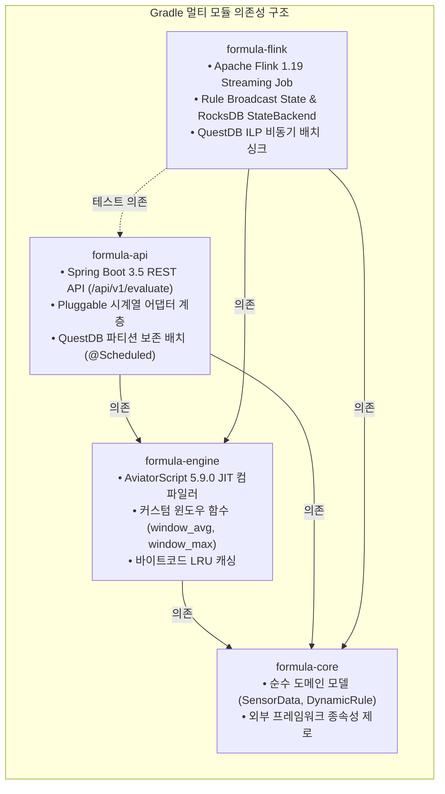
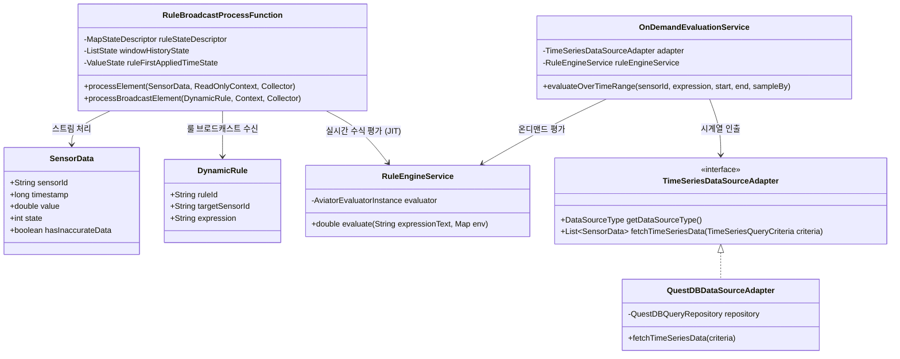
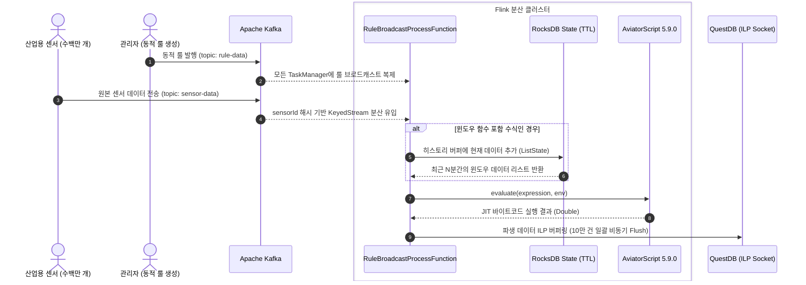
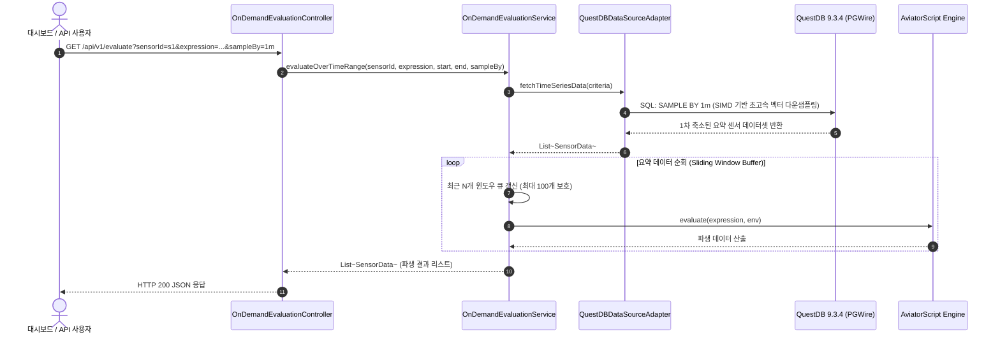
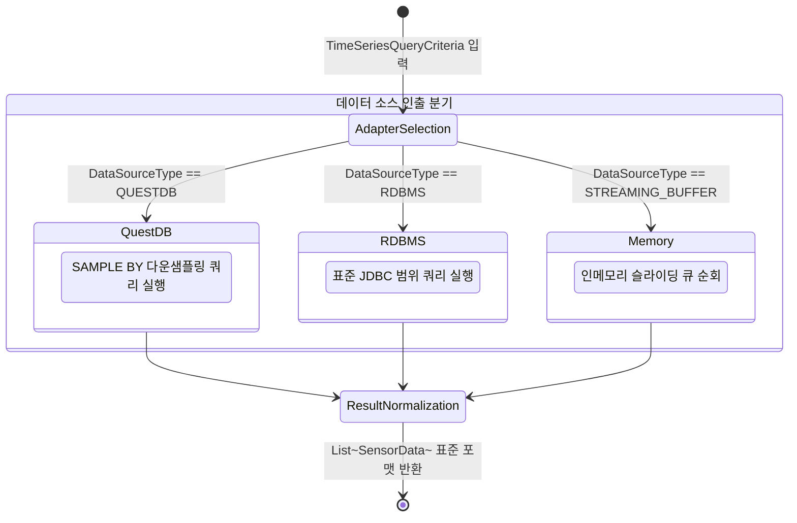
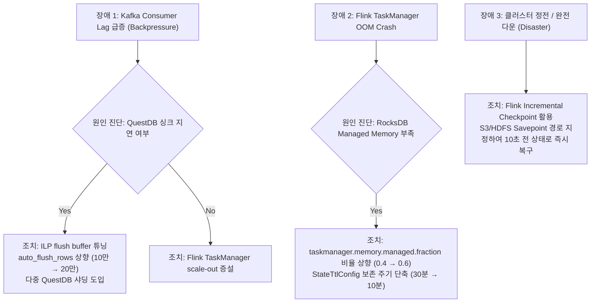

# 🚀 Formula Evaluator Service: 대규모 시스템 아키텍처 및 상세 가이드

본 문서는 대규모 IoT 시계열 데이터 평가 시스템(**Formula Evaluator Service**)의 아키텍처, Gradle 멀티 모듈 구조, 고성능 분산 처리 원리 및 운영 가이드를 총망라한 엔지니어링 기술 문서입니다.

---

## 1. 시스템 탄생 배경 및 설계 원칙

### 1.1 해결 과제 (High Cardinality & High Throughput)
* **초고속 유입량**: 산업 현장의 수백만 대 설비(Sensor)로부터 1초 이하 간격으로 원본 데이터가 쏟아져 들어옵니다.
* **동적 수식 평가**: 수십만 개의 사용자 정의 룰(Rule, 예: `value > 50 && window_avg(3) > 10`)을 시스템 중단 없이 런타임에 즉시 컴파일하여 파생 데이터를 도출해야 합니다.
* **단일 RDBMS의 한계**: 건별 INSERT/SELECT에 의존하는 기존 구조는 커넥션 고갈, 잠금(Lock) 경합, GC 오버헤드로 인해 시스템 장애를 유발합니다.

### 1.2 듀얼 패스(Dual-Path) 아키텍처 원칙
이러한 요구사항을 해결하기 위해 시스템의 처리 경로를 **실시간 스트리밍 경로**와 **온디맨드 즉석 평가 경로**로 명확히 분리했습니다.

| 비교 항목 | 1. 실시간 스트리밍 경로 (Streaming Path) | 2. 온디맨드 즉석 평가 경로 (On-Demand Path) |
| :--- | :--- | :--- |
| **핵심 엔진** | **Apache Flink 1.19** + RocksDB | **Spring Boot 3.5** + **QuestDB 9.3.4** |
| **처리 대상** | 실시간 유입되는 무한 센서 스트림 | 과거 수억 건의 축적된 시계열 데이터 백테스팅 |
| **처리 지연시간** | Sub-second (밀리초 단위 스트리밍) | 대시보드 인터랙티브 조회 (수백 밀리초 단위) |
| **룰 전파 방식** | Flink **Broadcast State** (워커 전원 로컬 복제) | Spring 빈 주입 기반 런타임 컴파일 |
| **상태 저장소** | RocksDB StateBackend + 30분 TTL | QuestDB 디스크 파티션 + Spring 인메모리 버퍼링 |
| **주요 장점** | 무중단 룰 적용, 수평적 스케일아웃 | DB 레벨 SIMD 벡터화 다운샘플링 (`SAMPLE BY`) |

---

## 2. 프로젝트 멀티 모듈 아키텍처

프로젝트는 모듈 간 결합도를 낮추고 도메인과 엔진의 재사용성을 높이기 위해 4개의 세부 모듈로 분리되어 있습니다.



### 모듈별 패키지 및 주요 클래스

```
formula-evaluator-service/
├── formula-core/
│   └── src/main/java/com/imoil/formula/domain/
│       ├── SensorData.java         # 표준 시계열 데이터 모델 (sensorId, timestamp, value, state)
│       └── DynamicRule.java        # 동적 룰 정의 (ruleId, targetSensorId, expression)
├── formula-engine/
│   └── src/main/java/com/imoil/formula/engine/
│       ├── RuleEngineConfig.java   # AviatorEvaluatorInstance 빈 설정
│       ├── RuleEngineService.java  # 수식 평가 서비스 (바이트코드 캐시 활용)
│       └── functions/
│           ├── WindowAvgFunction.java # window_avg(N) 이동 평균 커스텀 함수
│           └── WindowMaxFunction.java # window_max(N) 이동 최대값 커스텀 함수
├── formula-api/
│   └── src/main/java/com/imoil/formula/
│       ├── FormulaEvaluatorApplication.java # Spring Boot 메인 애플리케이션
│       ├── api/OnDemandEvaluationController.java # REST API (/api/v1/evaluate)
│       ├── service/OnDemandEvaluationService.java # 온디맨드 버퍼링 & 평가 연계
│       ├── service/QuestDBIngestionService.java   # ILP 프로토콜 배치 수집기
│       ├── service/QuestDBRetentionService.java   # DROP PARTITION 자동 만료기
│       └── datasource/                            # 플러그형 시계열 어댑터 계층
│           ├── TimeSeriesDataSourceAdapter.java
│           ├── QuestDBDataSourceAdapter.java
│           ├── RdbmsDataSourceAdapter.java
│           └── StreamingBufferDataSourceAdapter.java
└── formula-flink/
    └── src/main/java/com/imoil/formula/flink/
        ├── StreamingEvaluatorJob.java         # Flink 스트리밍 파이프라인 엔트리포인트
        ├── RuleBroadcastProcessFunction.java  # Broadcast State & RocksDB 윈도우 평가
        └── QuestDbIlpSink.java                # 고속 ILP TCP 소켓 싱크
```

---

## 3. 핵심 도메인 및 클래스 연관 구조



---

## 4. 고성능 비기능 요구사항(NFR) 해결 메커니즘

### ① Flink KeyedStream & Broadcast State
* **작업자 균등 분배**: `keyBy(SensorData::getSensorId)`를 통해 수백만 센서가 TaskManager 노드들에 락(Lock) 없이 해시 기반으로 병렬 분산됩니다.
* **네트워크 무조회 (Zero External Lookup)**: 센서 1건마다 외부 DB나 Redis를 조회하지 않고, Flink의 `BroadcastStream`을 통해 워커 메모리에 동적 룰 메타데이터를 100% 로컬 복제합니다.

### ② AviatorScript 5.9.0 JIT 바이트코드 컴파일
* 수식 파싱 오버헤드를 배제하기 위해 `instance.setCachedExpressionByDefault(true)`를 활성화합니다.
* 최초 1회 문자열 수식이 유입되면 즉시 **순수 자바 바이트코드 클래스**로 컴파일된 후 JVM Metaspace/Heap에 캐싱되어 이후 마이크로초(μs) 단위로 실행됩니다.

### ③ RocksDB StateBackend & TTL 메모리 보호
* 모든 센서의 30분치 슬라이딩 윈도우 히스토리를 힙에 적재하면 OOM이 발생합니다.
* `EmbeddedRocksDBStateBackend`를 탑재하여 힙 임계치를 넘는 윈도우 상태는 로컬 NVMe 디스크로 안전하게 오프로드(Spill-to-disk)됩니다.
* `StateTtlConfig`를 적용하여 30분이 지난 윈도우 상태는 백그라운드 컴팩션 과정에서 자동으로 만료·해제됩니다.

### ④ 불필요한 히스토리 메모리 절약 & 불완전 데이터 플래깅
* 수식에 `window_` 또는 `previous_` 함수가 포함된 경우에만 `ListState`에 센서 이력을 누적합니다.
* 룰이 새로 생성된 직후에는 윈도우 데이터가 채워질 때까지 `hasInaccurateData = true` 플래그를 달아 불완전한 상태임을 외부에 명시합니다.

### ⑤ QuestDB ILP (Influx Line Protocol) 비동기 다중화 싱크
* 행 단위 JDBC INSERT 대신 `QuestDbIlpSink`를 통해 인메모리 버퍼에 10만 건씩 적재 후 주기적으로 TCP 소켓 플러시(`auto_flush_interval=1000;auto_flush_rows=100000;`)를 수행합니다.

---

## 5. 상세 실행 시퀀스 (Execution Flows)

### 5.1 실시간 스트리밍 경로 (Streaming Path)



---

### 5.2 온디맨드 즉석 평가 경로 (On-Demand Path)



---

## 6. 플러그형 시계열 데이터 소스 아키텍처 (DataSource Adapters)

시스템은 엔터프라이즈 환경의 다양한 저장소 요구사항에 유연하게 대응하기 위해 **어댑터 패턴(Adapter Pattern)**을 적용했습니다.

| 어댑터 구현체 | 지원 데이터 소스 | 주요 활용 시나리오 | 동작 특성 |
| :--- | :--- | :--- | :--- |
| **`QuestDBDataSourceAdapter`** | QuestDB (기본값) | 대규모 시계열 온디맨드 조회 | `SAMPLE BY` 시간축 다운샘플링으로 네트워크 I/O 최소화 |
| **`RdbmsDataSourceAdapter`** | PostgreSQL, Oracle, MySQL | 전통적인 RDBMS 환경 연동 | JDBC DataSource 기반 `BETWEEN` 범위 쿼리 |
| **`StreamingBufferDataSourceAdapter`** | JVM 인메모리 링 버퍼 | 초저지연 테스트 및 캐시 계층 | ConcurrentHashMap 기반 최근 이벤트 즉석 인출 |



---

## 7. 커스텀 수식 함수 개발 가이드 (Extension Guide)

`formula-engine` 모듈에 새로운 도메인 특화 수식 함수(예: 최근 N개 데이터의 변화율 `window_rate(N)`)를 추가하는 방법입니다.

### 1단계: 함수 클래스 구현
`formula-engine/src/main/java/com/imoil/formula/engine/functions/` 디렉터리에 `AbstractFunction`을 상속하는 클래스를 생성합니다.

```java
package com.imoil.formula.engine.functions;

import com.googlecode.aviator.runtime.function.AbstractFunction;
import com.googlecode.aviator.runtime.type.AviatorDouble;
import com.googlecode.aviator.runtime.type.AviatorObject;
import org.springframework.stereotype.Component;

import java.util.List;
import java.util.Map;

@Component
public class WindowRateFunction extends AbstractFunction {

    @Override
    public String getName() {
        return "window_rate"; // 수식에서 사용할 함수 키워드
    }

    @Override
    public AviatorObject call(Map<String, Object> env, AviatorObject arg1) {
        int windowSize = ((Number) arg1.getValue(env)).intValue();
        
        @SuppressWarnings("unchecked")
        List<Double> window = (List<Double>) env.get("window_data");
        if (window == null || window.size() < 2) {
            return AviatorDouble.valueOf(0.0);
        }

        double first = window.get(0);
        double last = window.get(window.size() - 1);
        double rate = (last - first) / first * 100.0;

        return AviatorDouble.valueOf(rate);
    }
}
```

### 2단계: 엔진 빈 설정 등록
[`RuleEngineConfig.java`](file:///C:/Users/imoil/repo/formula-evaluator-service/formula-engine/src/main/java/com/imoil/formula/engine/RuleEngineConfig.java)에 새로 만든 함수 빈을 주입받아 바인딩합니다.

```java
@Configuration
public class RuleEngineConfig {

    @Bean
    public AviatorEvaluatorInstance aviatorEvaluatorInstance(
            WindowAvgFunction windowAvgFunction,
            WindowMaxFunction windowMaxFunction,
            WindowRateFunction windowRateFunction) { // 신규 함수 추가
        
        AviatorEvaluatorInstance instance = AviatorEvaluator.newInstance();
        instance.setCachedExpressionByDefault(true);
        
        instance.addFunction(windowAvgFunction);
        instance.addFunction(windowMaxFunction);
        instance.addFunction(windowRateFunction); // 바인딩 등록

        return instance;
    }
}
```

---

## 8. 대규모 인프라 사이징 및 장애 대응 (Capacity Planning & DR)

### 8.1 인프라 권장 사이징 매트릭스 (기준: 원본 센서 500만 개/초, 룰 50만 개)

| 인프라 컴포넌트 | 최소 권장 사양 | 디스크 스토리지 | 핵심 튜닝 파라미터 |
| :--- | :--- | :--- | :--- |
| **Apache Kafka** | 10~15대 (각 8 Core, 32GB RAM) | NVMe SSD (500MB/s+ 쓰기) | 토픽 파티션 512개 이상 분할, `compression.type=lz4` |
| **Flink TaskManager** | 15~20대 (각 16 Core, 64GB RAM) | 워커당 1~2TB NVMe SSD | RocksDB Off-Heap 비율 60%, G1GC 적용 |
| **QuestDB Master** | 단독 서버 (32 Core, 128GB RAM) | 고속 엔터프라이즈 NVMe | `cairo.max.uncommitted.rows=200000`, 자동 파티션 드롭 |

### 8.2 핵심 운영 장애 시나리오 및 해결 절차


