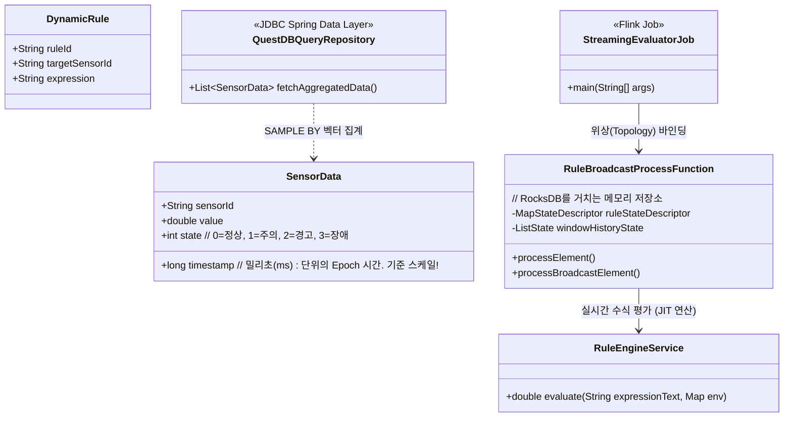
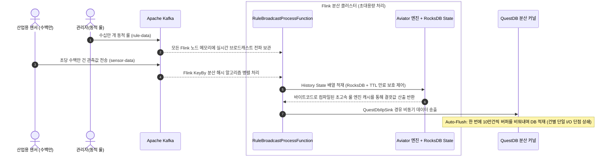
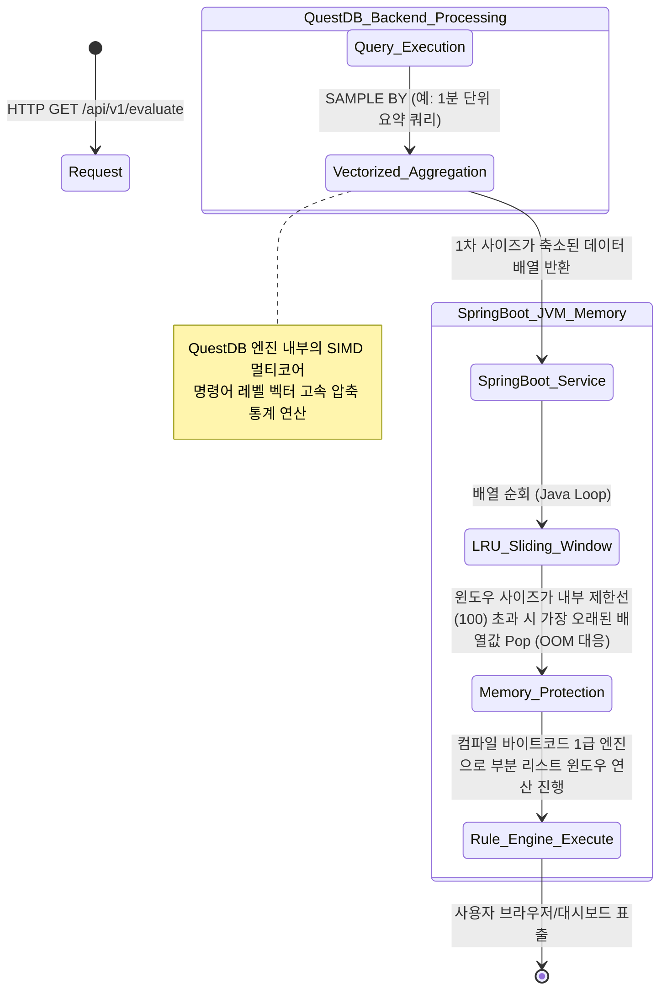

# 🚀 Formula Evaluator Service: 대규모 시스템 아키텍처 및 상세 동작 가이드

환영합니다! 이 문서는 평가 엔진 시스템(Formula Evaluator Service)을 바닥부터 다시 이해해야 하는 주니어 개발자들을 위해 작성된 아주 상세한 구조 설명서입니다. 
센서에서 데이터가 발생하여 최종 서빙 및 파기되는 전체 **순환 라이프사이클(Lifecycle)**과 더불어, 압도적인 트래픽을 처리하는 **기반 원리**를 포함하여 설명합니다.

---

## 1. 우리 시스템의 탄생 배경과 해결 과제 (Introduction)

### 1.1 기술적 극복 대상 (High Cardinality & High Throughput)
공장에 수백만 대의 설비(Sensor)가 있고, 여기서 초당 수백만 개의 데이터를 뱉어냅니다. 
동시에 관리자가 부여하는 **수십만 개의 커스텀 윈도우 수식(예: A 센서의 최근 10초 평균이 50을 초과)**을 지연율 없이 즉각 평가하여 파생 센서(Rule Sensor) 데이터를 만들어내야 합니다.
이를 처리하기 위해 전통적인 RDBMS 단일 커넥션 구조를 쓰면 네트워크 병목, 병렬성 부족, 메모리 한계로 인해 시스템이 즉시 다운됩니다.

### 1.2 Dual-Path 아키텍처의 도입
이 거대한 비기능적 요구사항(Non-Functional Requirements)을 해소하기 위해 아키텍처를 두 가닥으로 분리했습니다.
1. **Streaming Path (초당 수백만 건 처리 - Apache Flink)**
   - 흐르고 있는 데이터 스트림을 가로채어 그 즉시 룰을 평가합니다. (분산 메모리 처리)
2. **On-Demand Path (과거 데이터 소급 백테스팅 - Spring Boot & QuestDB)**
   - 이미 저장된 과거 수억 건의 데이터에 새로운 룰을 테스트할 때, 데이터베이스 레이어에서 1차 심도 압축(SIMD 기반 다운샘플링)을 수행한 뒤 서버 단에서 2차 평가합니다.

---

## 2. 전체 도메인 및 클래스 연관도 (Class Diagram)

시스템의 논리적 구조입니다. Flink와 Spring Boot가 `RuleEngineService`를 공유하여 계산 메커니즘을 100% 동일하게 가져갑니다.



---

## 3. 강력한 비기능적 요구사항(NFR)과 3대 아키텍처 해결 원리

요구사항 문서에 기재된 **"초당 수백만 개의 원본 센서 & 수십만 개의 룰 연산"**을 견디기 위해, 시스템은 다음과 같이 아키텍트되어 있습니다. 

### ① 거대한 처리량(Throughput) 분산 처리 원리
* **분산 워커 할당 (Flink `keyBy`):** Flink 코어에 적용된 `keyBy(SensorData::getSensorId)` 구문은 랜덤 파티셔닝이 아니라 해시 파티셔닝입니다. 아무리 많은 센서(100만 개)가 들어와도 수평적으로 추가된 물리 서버(Task Manager) 노드들에 각각의 센서가 **락(Lock) 없이 고르게 분배**됩니다.
* **TCP 소켓 비동기 멀티플렉싱 플러시 (QuestDB ILP):** 삽입 시 건별로 연결(Connection)을 열고 닫는 JPA나 JDBC를 쓰면 커넥션 고갈로 데드락이 발생합니다. 우리는 `StreamingEvaluatorJob` 내 싱크 파라미터에 `"auto_flush_interval=1000;auto_flush_rows=100000"`옵션을 주어 TCP TCP 소켓이 메모리 버퍼 체인에 일단 적재한 뒤 주기적으로 한방에 흘려보내게(Flush) 설계했습니다. I/O 병목이 제로에 수렴합니다.

### ② 수십만 개의 Rule 평가 지연 제로(Zero-Latency) 원리
* **네트워크 외부 조회 배제 (Broadcast State):** 수십만 개의 룰 평가는 빈번한 평가 과정마다 외부 시스템(Redis나 DB)을 1번이라도 조회하면 안 됩니다. Flink의 `BroadcastStream` 메커니즘을 사용하여 모든 개별 워커 서버 로컬 메모리에 룰 메타데이터를 전면 복제시킵니다.
* **바이트코드 번역 캐시 (AviatorScript JIT):** 문자로 된 복잡한 룰 수식을 리플렉션으로 풀거나 문자열 파싱하면 막대한 CPU 자원이 소모됩니다. `setCachedExpressionByDefault(true)` 옵션을 통해 시스템으로 인입된 문자열 수식은 **최초 1회에 오직 자바 순수 바이트코드(Java Class Bytecode) 로 컴파일된 이후 JVM 힙 공간 메모리에 영구 캐시**됩니다. 컴파일 이후에는 일반적인 자바 메소드 호출과 동일한 속도(마이크로초 단위)를 냅니다.

### ③ 메모리 폭발 누수(OOM) 방어 체계 
* **스필 투 디스크 (RocksDB State Backend):** 수백만 대의 센서가 과거 수십 분의 히스토리를 메모리에 쥐고 있으면 JVM 메모리가 폭발(OOM)합니다. 이를 방지하기 위해 힙 여유 용량을 초과하면 데이터를 로컬 디스크 파티션 체인으로 자연스럽게 오프로드(Offload) 시키는 `EmbeddedRocksDBStateBackend` 기술을 접목했습니다. (빠른 속도를 유지하면서 디스크를 사실상의 거대 RAM처럼 활용)
* **소멸 기한 부여 (TTL - Time to Live):** 윈도우 스토리지 상태 구조체에 Flink 내장 `StateTtlConfig`를 사용해 '최초 생성 시점으로부터 30분 만기'를 걸어두어, 이후 가비지 컬렉터(GC)에 의해 알아서 소외 공간 메모리가 자가 해제되도록 안전장치를 확보했습니다.

---

## 4. 라이프사이클 흐름 체계도 (Sequence & Activity)

### 4.1 실시간 스트리밍 흐름 (Streaming Path)


### 4.2 과거 데이터 즉석 조회 (On-Demand Path)
기존에 저장된 기가 단위의 거대한 기록 데이터를 온디맨드 뷰어 컨테이너에서 꺼낼 때 적용되는 DB 레벨 병렬 압축 테크닉입니다.


---

## 5. 💡 [가이드] 나만의 커스텀 수식 함수 개발 및 룰 엔진 추가 방법!

시스템의 수식 구문 `"value > 50 && window_avg(3) > 10"` 형태를 계속 사용하다가, 현업 부서에서 불현듯 **"최근 N회 사이의 변화율(Rate)을 구하는 `window_rate(10)` 이라는 독자 함수를 추가해주세요"** 라고 요청했다면 주니어 개발자는 어떻게 작업해야 할까요? 전혀 어렵지 않습니다! 아래의 2단계 방식만 따라 하시면 전역 분산 클러스터에 여러분이 직접 만든 수식 계산 로직이 통합됩니다.

### 단계 1: 구상한 함수 클래스 작성
Aviator가 제공하는 `AbstractFunction` 모듈을 상속받는 자바 구현체 클래스를 `com.imoil.formula.engine.functions` 패키지 하위에 생성합니다.

```java
// WindowRateFunction.java 예시
import com.googlecode.aviator.runtime.function.AbstractFunction;
import com.googlecode.aviator.runtime.type.AviatorDouble;
import com.googlecode.aviator.runtime.type.AviatorObject;
// ... 기타 임포트 ...

public class WindowRateFunction extends AbstractFunction {

    @Override
    public String getName() {
        return "window_rate"; // 현업 담당자 및 관리자가 대시보드에서 작성할 실제 함수 키워드!
    }

    @Override
    public AviatorObject call(Map<String, Object> env, AviatorObject arg1) {
        // 1. 함수 괄호 안에 넘어오는 인자값(정수) 추출 (예: window_rate(10) 이면 10)
        int checkCount = ((Number) arg1.getValue(env)).intValue();
        
        // 2. Flink나 Spring이 주입해준 해당 센서의 현재까지 window(최근 이력 데이터) 리스트를 추출
        List<SensorData> history = (List<SensorData>) env.get("windowHistory");
        
        if (history == null || history.isEmpty()) return new AviatorDouble(0);
        
        // --- (여기서부터 원하시는 도메인 핵심 로직을 자유롭게 작성 구역) ---
        // 예: 리스트가 모자란(비어있는) 건 무시하고 마지막 값과 최초 값의 변화율 계산 구현 등
        // -------------------------------------------------------------
        
        double rateResult = 15.5; // (샘플 계산값이라 가정)
        // 3. 반드시 최종 Aviator 호환 랩퍼 객체(AviatorDouble, AviatorLong 등)로 변환/매핑하여 반환!
        return new AviatorDouble(rateResult); 
    }
}
```

### 단계 2: 시스템 전역(Spring/Flink) Aviator 룰 엔진 바인딩(Binding)
위에서 만든 스프링 빈 인스턴스를 Flink 워커 노드 컨텍스트와 Spring Boot 온디맨드 컨텍스트 양쪽에 동일하게 주입하기 위해 `RuleEngineConfig`에 추가 선언만 해주시면 등록 작업이 마무리됩니다!

```java
// RuleEngineConfig.java 변경
@Configuration
public class RuleEngineConfig {
    
    // 파라미터 매개변수 선언부에 새로 만든 WindowRateFunction 의존성을 하나만 더 추가해 주시면 됩니다.
    @Bean
    public AviatorEvaluatorInstance aviatorEvaluatorInstance(
            WindowAvgFunction windowAvgFunction,
            WindowMaxFunction windowMaxFunction,
            WindowRateFunction windowRateFunction) { // ⭐ 신규 추가된 파라미터
        
        AviatorEvaluatorInstance instance = AviatorEvaluator.newInstance();
        instance.setCachedExpressionByDefault(true);
        
        instance.addFunction(windowAvgFunction);
        instance.addFunction(windowMaxFunction);
        instance.addFunction(windowRateFunction); // ⭐ 엔진에 함수 플러그인 바인딩 완료

        return instance;
    }
}
```

📢 **(필수 참고사항):** Flink 스트리밍 모드에서 호출되는 `RuleBroadcastProcessFunction` 내부의 `RuleEngineConfig config = new RuleEngineConfig()` 초기화 인스턴스화 로직에서도 동일하게, `config.aviatorEvaluatorInstance(...)` 호출 부의 인자로 `new WindowRateFunction()` 파라터를 하나 덧대어 추가해주시면 스트리밍/과거데이터 평가 환경 구축이 양쪽 모두 완벽히 연동됩니다! 이제 어떠한 부하 상황에서도 분산 컴퓨팅 클러스터 전역에 새로 배포하신 `window_rate(10)` 이라는 수식을 현업 사용자가 제약 수식으로 마음껏 사용할 수 있게 됩니다.

---

## 6. 🌩️ 초대규모 운영을 위한 리소스 산정 및 장애 대응 가이드 (Capacity Planning & DR)

요구사항 기준인 **원본 센서 500만 개(5M/s)** 와 **Rule 센서 50만 개(500K)** 가 온전히 실가동되는 초대규모(Hyperscale) 운영 상황이라면 시스템이 견뎌야 하는 초당 트래픽은 상상을 초월합니다. 이러한 메가 스케일 환경에서의 인프라 산정 및 재난 복구(DR) 시나리오를 안내합니다.

### 6.1 예상 리소스 산정 (Hardware Sizing)
* **Kafka 인프라 (Throughput: 초당 500MB+):**
  * **Brokers:** 센서 데이터(Topic)를 병렬 분산하기 위해 최소 10~15대 이상의 물리/VM 브로커 클러스터가 필요하며, 파티션(Partition) 은 512개 수준으로 극도로 분할되어야 합니다.
  * **Disk:** 초당 대량 쓰기를 감당할 수 있는 초고속 NVMe SSD가 필수입니다.
* **Flink 클러스터 (Eval 5,000,000 TPS):**
  * **CPU:** Aviator의 바이트코드 실행이 1마이크로초 내외라 하더라도 초당 500만 번의 연산엔 막대한 스레드가 필요합니다. 워커 노드당 16 코어 기준으로 약 10~15대 (총 160~240 Cores)의 TaskManager Scale-out이 필요합니다.
  * **Memory & Storage:** Broadcast 되는 50만 개의 컴파일된 Rule 메모리는 워커당 약 1GB 미만으로 충분하여 Heap Memory 위협은 적으나, **500만 센서의 30분치 슬라이딩 윈도우 과거 상태(State)** 는 엄청난 용량을 자랑합니다. 메모리 대신 로컬 디스크에 기록하는 **RocksDB를 위해 각 물리 장비당 최소 1~2TB 급 NVMe SSD 마운트**가 강제됩니다. 일반 HDD를 쓰면 State 병목으로 마비됩니다.
* **QuestDB 인프라 (초고속 TimeSeries Ingestion):**
  * **CPU & RAM:** ILP 처리 분산을 위해 단일 코어가 아닌 16코어 이상 64GB RAM 급 이상의 단독 마스터 노드가 필요하며, I/O Wait 대기를 해소할 스토리지 인프라 연결이 최우선입니다. (데이터 보존 주기에 따른 디스크 용량 테라급 확보)

### 6.2 핵심 운영 장애 시나리오 및 대응 방법 (Troubleshooting)

**장애 1. 백프레셔(Backpressure) 현상 및 Kafka Lag 급증**
* **증상:** 초당 500만 건 이상이 터져 들어오면서 Flink UI 그래프가 붉은색(100% Busy)으로 변하고 DB나 파생결과 딜레이가 몇 분 이상 점점 벌어지는 현상. 
* **원인 & 대응 방안:**
  1. 가장 의심해야 할 병목은 `QuestDbIlpSink` 의 쓰기 대기입니다. QuestDB가 500만 건 트래픽을 견디지 못하고 느려지면 Flink 전체 파이프라인이 멈춥니다.
  2. 👉 **조치:** `auto_flush_interval`을 줄이거나 `auto_flush_rows` 크기를 늘려 일괄 Batch 덩치를 튜닝하며, QuestDB 서버 자체의 CPU/Disk IOPS 리미트를 해제해야 합니다. 그럼에도 한계에 도달하면 싱크(Sink)단 분산 저장을 위해 다중 QuestDB 인스턴스 샤딩(Sharding) 구조를 도입해야 합니다.

**장애 2. Flink TaskManager OOM (가비지 컬렉터 마비) 혹은 멈춤**
* **증상:** Flink Job이 빈번하게 재시작(Restart)되며 노드가 끊임없이 죽는 상황.
* **원인 & 대응 방안:**
  1. State Backend가 RocksDB로 설정되어 애플리케이션 Heap이 직접 터질 확률은 적으나, Off-Heap (Managed Memory) 사이즈가 너무 작으면 RocksDB Memory 버퍼가 부족해져 크래시가 돕니다.
  2. 👉 **조치:** TaskManager 1대당 `taskmanager.memory.managed.fraction` 비율을 높게 부여하여 RocksDB가 사용할 OS 메모리를 충분히 열어주고, 불필요한 GC 휴지기를 막기 위해 G1GC 튜닝이 동반되어야 합니다. 또한, 30분으로 지정된 `StateTtlConfig` 만료 주기를 비즈니스와 타협하여 10분이나 5분으로 극적으로 줄이면 메모리와 디스크 부하가 기하급수적으로 쾌적해집니다.

**장애 3. 인프라 전체 정전 및 Flink 완전 종료 (Disaster Recovery)**
* **증상:** 하드웨어 폴트나 배포 실수로 클러스터 전체가 셧다운 되어 지난 30분간 누적해둔 500만 센서의 Window History(이동 평균) 배열이 모두 소멸할 위기.
* **대응 방안:** Flink 의 메커니즘 중 이미 구현된 **Incremental Checkpointing (증분 체크포인트)** 을 활용합니다. Flink는 10초마다 RocksDB 데이터 변경점만 압축하여 외부의 S3(혹은 HDFS)로 스냅샷을 백업하고 있습니다.
  * 👉 **조치:** 시스템을 재기동할 때, 이전 스냅샷의 `savepoint` 디렉토리 경로만 바라보도록 파라미터를 입력하고 Run 하면, 분산 환경의 각 메모리가 "직전 10초 전 완벽한 상태" 로 기적같이 자동 원복(Resume)되어 데이터 유실을 단 1건도 허용하지 않게 됩니다.
