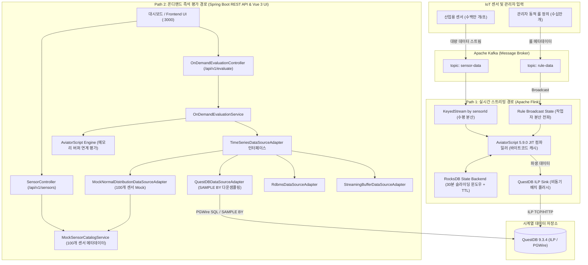
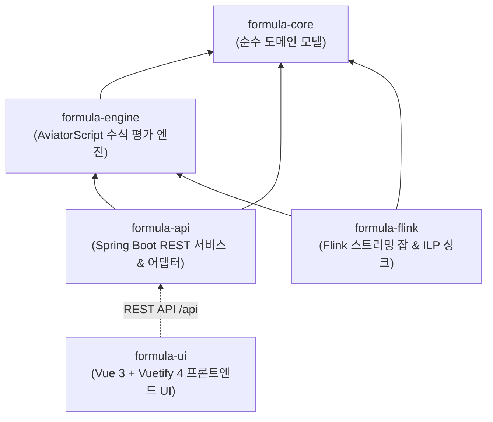
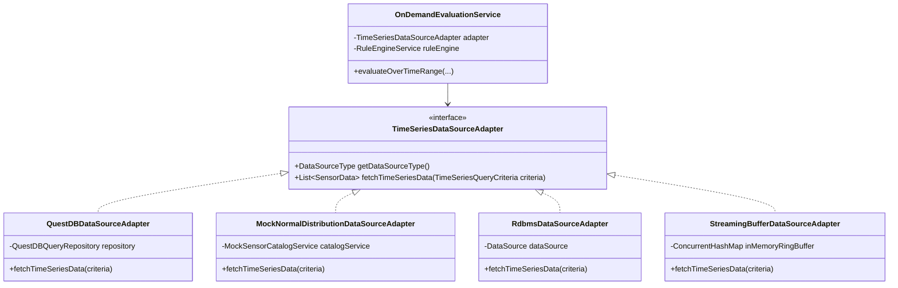

# 🚀 대규모 IoT 시계열 데이터 평가 시스템 (Formula Evaluator Service)

[](https://adoptium.net/)
[](https://spring.io/projects/spring-boot)
[](https://gradle.org/)
[](https://flink.apache.org/)
[](https://questdb.io/)
[](https://github.com/killme2008/aviatorscript)
[](https://vuejs.org/)
[](https://vuetifyjs.com/)

본 프로젝트는 1초 이하 간격으로 유입되는 수백만 대의 IoT 센서 시계열 데이터를 지연 없이 수집하고, 사용자가 정의한 동적 수식(Formula)과 윈도우 집계 로직을 즉각 컴파일하여 파생 데이터를 계산하는 **고성능 듀얼 패스(Dual-Path) 분산 처리 시스템**입니다.

---

## 🏛️ 시스템 아키텍처 개요

### 1. 듀얼 패스 실행 아키텍처 (Dual-Path Architecture)

시스템은 실시간성과 분석 성능을 극대화하기 위해 두 가지 상호 보완적인 처리 경로를 제공합니다.



---

## 📦 멀티 모듈 구조 (Multi-Module Architecture)

프로젝트는 명확한 관심사 분리(SoC)와 재사용성을 고려하여 4개의 백엔드 모듈과 1개의 프론트엔드 모듈로 구성되어 있습니다.



### 모듈별 책임 및 구성

| 모듈명 | 유형 | 주요 기술 | 책임 및 기능 |
| :--- | :--- | :--- | :--- |
| **`formula-core`** | Java Library | Lombok | 외부 프레임워크 의존성이 없는 순수 도메인 모델 (`SensorData`, `DynamicRule`) 정의 |
| **`formula-engine`** | Java Library | AviatorScript 5.9.0, Spring Context | 동적 수식 JIT 컴파일 및 바이트코드 캐싱, 커스텀 윈도우 함수 (`window_avg`, `window_max`) 바인딩 |
| **`formula-api`** | Spring Boot Application | Spring Boot 3.5, Spring Data JPA, PostgreSQL Wire | 온디맨드 평가 REST 엔드포인트 (`/api/v1/evaluate`), 센서 카탈로그 API (`/api/v1/sensors`), 플러그형 시계열 어댑터 (`MOCK`, `QUESTDB`), 파티션 자동 보존 배치 |
| **`formula-flink`** | Flink Streaming Job | Apache Flink 1.19, RocksDB, Kafka Connector | 분산 스트리밍 평가 파이프라인, Broadcast State 패턴 기반 룰 전파, QuestDB ILP 비동기 적재 |
| **`formula-ui`** | Frontend SPA | Vite, Vue 3, Vuetify 4, ECharts, Pinia, pnpm | 온디맨드 수식 작성/저장, 합성 수식(수식 간 호출 DAG), 100개 센서 1초 간격 정규분포 시뮬레이션 및 시계열 시각화 |

---

## 🛠️ 기술 스택 (Tech Stack)

| 구분 | 기술 / 라이브러리 | 버전 | 설명 |
| :--- | :--- | :--- | :--- |
| **Language** | Java (OpenJDK) | **25** (LTS) | 최신 가상 스레드 및 메모리 모델 지원 |
| **Build Tool** | Gradle | **9.8.0** | Version Catalog (`libs.versions.toml`) 기반 멀티 모듈 관리 |
| **Framework** | Spring Boot | **3.5.16** | REST API, Spring Data JPA, 스케줄링 관리 |
| **Stream Engine** | Apache Flink | **1.19.0** | 분산 스트리밍 처리, RocksDB 상태 백엔드 |
| **TSDB** | QuestDB | **9.3.4** | ILP 초고속 적재 (Zero-GC), PGWire SQL 및 `SAMPLE BY` 다운샘플링 |
| **Rule Engine** | AviatorScript | **5.9.0** | `io.github.aviatorscript:aviator`, 바이트코드 컴파일 캐싱 |
| **Message Broker**| Apache Kafka | **3.9.2** | 센서 데이터 및 룰 배포 큐 |
| **Frontend** | Vue 3 + Vuetify 4 | **3.5** / **4.2** | TypeScript, Composition API, ECharts 6.1, Pinia, Vite 8, pnpm |
| **Testing** | JUnit 5, Mockito, Testcontainers, Vitest | - | 단위/통합 테스트 자동화 |

---

## 🔌 플러그형 시계열 데이터 소스 아키텍처 (Pluggable DataSource)

`formula-api`는 특정 데이터베이스에 종속되지 않고 환경에 맞춰 저장소를 교체할 수 있는 어댑터 계층을 제공합니다.



---

## 🚀 빠른 시작 가이드 (Quick Start)

### 옵션 A: 로컬 Standalone Mock 모드 (외부 인프라 없이 즉시 실행)
Docker 설치 없이 백엔드 Mock 어댑터와 프론트엔드 UI를 실행하여 바로 수식 작성 및 100개 센서 시뮬레이션을 체험할 수 있습니다.

```powershell
# 터미널 1: 백엔드 실행 (Mock DataSource 프로파일)
# Windows PowerShell:
gradle :formula-api:bootRun --args="--evaluation.datasource.type=MOCK"
# Linux / macOS Bash:
# ./gradlew :formula-api:bootRun --args='--evaluation.datasource.type=MOCK'
```

```bash
# 터미널 2: 프론트엔드 UI 실행
cd formula-ui
pnpm install
pnpm dev
# 브라우저에서 http://localhost:3000 접속
```

상세한 UI 사용법, DAG 수식 작성법 및 설정은 [FRONTEND_UI_GUIDE.md](docs/FRONTEND_UI_GUIDE.md)를 참고하세요.

---

### 옵션 B: 전체 인프라 연동 엔터프라이즈 모드 (QuestDB + Kafka 포함)

#### 1. 인프라 실행 (Podman / Docker)
```bash
# Podman 사용 시
podman-compose up -d

# Docker Compose 사용 시
docker compose -f podman-compose.yml up -d
```

#### 2. 프로젝트 빌드 및 백엔드 실행
```bash
# 전체 빌드
gradle clean build

# 백엔드 기동 (기본값: QUESTDB 어댑터 활성화)
gradle :formula-api:bootRun
```

#### 3. Flink Job 실행 파라미터
```bash
flink run -c com.imoil.formula.flink.StreamingEvaluatorJob formula-flink/build/libs/formula-flink-0.0.1-SNAPSHOT.jar \
  --kafka-bootstrap-servers "localhost:9092" \
  --kafka-topic-sensor "sensor-data" \
  --kafka-topic-rule "rule-data" \
  --retention-time-minutes 30 \
  --questdb-url "http::addr=localhost:9000;auto_flush_interval=1000;auto_flush_rows=100000;"
```

#### 4. 프론트엔드 UI 실행
```bash
cd formula-ui
pnpm dev
```

---

## 📡 REST API 규격

### 1. 온디맨드 수식 평가 (`GET /api/v1/evaluate`)
특정 기간의 센서 데이터를 시계열 저장소(또는 Mock 어댑터)에서 인출하여 동적 수식을 즉석 계산합니다.

```http
GET /api/v1/evaluate?sensorId=sensor_000&expression=value*1.8%2B32&startTime=2026-10-09T20:00:00Z&endTime=2026-10-09T21:00:00Z&sampleBy=1s
Content-Type: application/json
```

| 파라미터 | 필수 여부 | 기본값 | 설명 |
| :--- | :---: | :--- | :--- |
| `sensorId` | 필수 | - | 평가 대상 센서 고유 식별자 |
| `expression` | 필수 | - | AviatorScript 수식 (예: `value * 1.8 + 32`, `value > 50 ? value * 1.1 : value`) |
| `startTime` | 필수 | - | 조회 시작 일시 (ISO-8601 형식) |
| `endTime` | 필수 | - | 조회 종료 일시 (ISO-8601 형식) |
| `sampleBy` | 선택 | `1m` | QuestDB 다운샘플링 인터벌 (`1s`, `10s`, `1m`, `1h` 등) |

#### 응답 예시 (HTTP 200)
```json
[
  {
    "sensorId": "sensor_000_ondemand_eval",
    "timestamp": 1710000000000,
    "value": 125.8,
    "state": 0,
    "hasInaccurateData": false
  }
]
```

### 2. 가상 센서 카탈로그 목록 (`GET /api/v1/sensors`)
100개 가상 센서의 메타데이터(평균, 표준편차, 단위, 카테고리)를 반환합니다.

```http
GET /api/v1/sensors
Content-Type: application/json
```

### 3. 특정 센서 메타데이터 조회 (`GET /api/v1/sensors/{sensorId}`)
특정 센서 식별자의 파라미터를 조회합니다.

```http
GET /api/v1/sensors/sensor_000
Content-Type: application/json
```

### 4. 센서 1시간 시계열 조회 (`GET /api/v1/sensors/{sensorId}/timeseries`)
지정된 센서의 1시간(3,600건) 정규분포 시계열 원본 데이터를 반환합니다.

```http
GET /api/v1/sensors/sensor_000/timeseries?sampleBy=1s
Content-Type: application/json
```

---

## 📚 관련 상세 문서
* [Formula UI 아키텍처 및 사용자 가이드 (Frontend UI Guide)](docs/FRONTEND_UI_GUIDE.md)
* [스트리밍 평가 룰 전파 아키텍처 가이드](docs/STREAMING_EVALUATOR_GUIDE.md)
