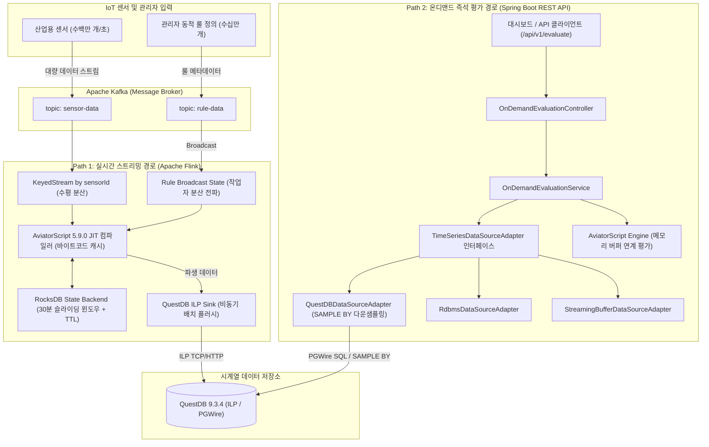
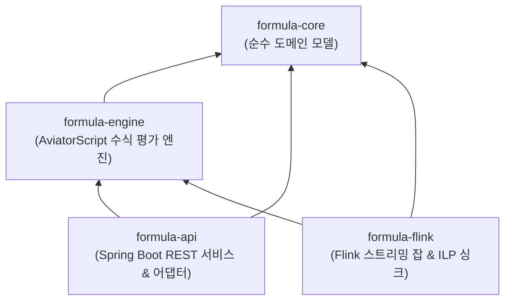
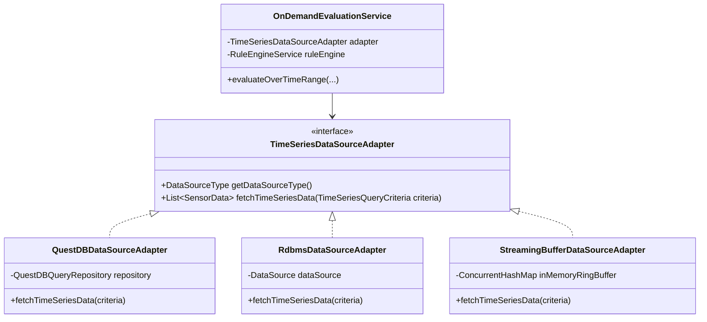

# 🚀 대규모 IoT 시계열 데이터 평가 시스템 (Formula Evaluator Service)

[](https://adoptium.net/)
[](https://spring.io/projects/spring-boot)
[](https://gradle.org/)
[](https://flink.apache.org/)
[](https://questdb.io/)
[](https://github.com/killme2008/aviatorscript)

본 프로젝트는 1초 이하 간격으로 유입되는 수백만 대의 IoT 센서 시계열 데이터를 지연 없이 수집하고, 사용자가 정의한 동적 수식(Formula)과 윈도우 집계 로직을 즉각 컴파일하여 파생 데이터를 계산하는 **고성능 듀얼 패스(Dual-Path) 분산 처리 시스템**입니다.

---

## 🏛️ 시스템 아키텍처 개요

### 1. 듀얼 패스 실행 아키텍처 (Dual-Path Architecture)

시스템은 실시간성과 분석 성능을 극대화하기 위해 두 가지 상호 보완적인 처리 경로를 제공합니다.



---

## 📦 멀티 모듈 구조 (Multi-Module Architecture)

프로젝트는 명확한 관심사 분리(SoC)와 재사용성을 고려하여 4개의 Gradle 서브모듈로 구성되어 있습니다.



### 모듈별 책임 및 구성

| 모듈명 | 유형 | 주요 기술 | 책임 및 기능 |
| :--- | :--- | :--- | :--- |
| **`formula-core`** | Java Library | Lombok | 외부 프레임워크 의존성이 없는 순수 도메인 모델 (`SensorData`, `DynamicRule`) 정의 |
| **`formula-engine`** | Java Library | AviatorScript 5.9.0, Spring Context | 동적 수식 JIT 컴파일 및 바이트코드 캐싱, 커스텀 윈도우 함수 (`window_avg`, `window_max`) 바인딩 |
| **`formula-api`** | Spring Boot Application | Spring Boot 3.5, Spring Data JPA, PostgreSQL Wire | 온디맨드 평가 REST 엔드포인트 (`/api/v1/evaluate`), 플러그형 시계열 어댑터, 파티션 자동 보존 배치 |
| **`formula-flink`** | Flink Streaming Job | Apache Flink 1.19, RocksDB, Kafka Connector | 분산 스트리밍 평가 파이프라인, Broadcast State 패턴 기반 룰 전파, QuestDB ILP 비동기 적재 |

---

## 🛠️ 기술 스택 (Tech Stack)

| 구분 | 기술 / 라이브러리 | 버전 | 설명 |
| :--- | :--- | :--- | :--- |
| **Language** | Java (OpenJDK) | **25** (LTS) | 최신 가상 스레드 및 메모리 모델 지원 |
| **Build Tool** | Gradle | **9.8.0** | Version Catalog (`libs.versions.toml`) 기반 멀티 모듈 관리 |
| **Framework** | Spring Boot | **3.5.16** | REST API, Spring Data JPA, 스케줄링 관리 |
| **Stream Engine** | Apache Flink | **1.19.0** | 분산 스트리밍 처리, RocksDB 상태 백엔드 |
| **TSDB** | QuestDB | **9.3.4** | ILP 초고속 적재 (Zero-GC), PGWire SQL 및 `SAMPLE BY` 다운샘플링 |
| **Rule Engine** | AviatorScript | **5.9.0** | `io.github.aviatorscript:aviator`, 바이트코드 컴파일 캐싱 |
| **Message Broker**| Apache Kafka | **3.9.2** | 센서 데이터 및 룰 배포 큐 |
| **Testing** | JUnit 5, Mockito, Testcontainers | 1.21.4 | 컨테이너 자동 감지 폴백 (`disabledWithoutDocker = true`) |

---

## 🔌 플러그형 시계열 데이터 소스 아키텍처 (Pluggable DataSource)

`formula-api`는 특정 데이터베이스에 종속되지 않고 환경에 맞춰 저장소를 교체할 수 있는 어댑터 계층을 제공합니다.



---

## 🚀 빠른 시작 가이드 (Quick Start)

### 1. 인프라 실행 (Podman / Docker)

프로젝트 루트의 `podman-compose.yml`을 사용하여 QuestDB 및 Kafka 환경을 실행합니다.

```bash
# Podman 사용 시
podman-compose up -d

# Docker Compose 사용 시
docker compose -f podman-compose.yml up -d
```

### 2. 프로젝트 빌드

Gradle을 사용하여 전체 멀티 모듈을 빌드합니다.

```bash
# 전체 모듈 클린 빌드 및 단위 테스트 실행
gradle clean build

# 특정 모듈 JAR 빌드
gradle :formula-api:bootJar
gradle :formula-flink:jar
```

### 3. Flink Job 실행 파라미터

`formula-flink` 잡은 클라우드 네이티브 환경 대응을 위해 `ParameterTool` 기반 외부 인자 주입을 지원합니다.

```bash
flink run -c com.imoil.formula.flink.StreamingEvaluatorJob formula-flink/build/libs/formula-flink-0.0.1-SNAPSHOT.jar \
  --kafka-bootstrap-servers "localhost:9092" \
  --kafka-topic-sensor "sensor-data" \
  --kafka-topic-rule "rule-data" \
  --retention-time-minutes 30 \
  --questdb-url "http::addr=localhost:9000;auto_flush_interval=1000;auto_flush_rows=100000;"
```

#### CLI 파라미터 옵션

| 옵션명 | 기본값 | 설명 |
| :--- | :--- | :--- |
| `--kafka-bootstrap-servers` | `localhost:9092` | Kafka 브로커 주소 |
| `--kafka-topic-sensor` | `sensor-data` | 원본 센서 데이터 토픽 |
| `--kafka-group-sensor` | `flink-sensor-group` | 센서 데이터 컨슈머 그룹 |
| `--kafka-topic-rule` | `rule-data` | 동적 룰 메타데이터 토픽 |
| `--kafka-group-rule` | `flink-rule-group` | 룰 데이터 컨슈머 그룹 |
| `--retention-time-minutes` | `30` | 윈도우 계산용 히스토리 보존 시간 (분) |
| `--questdb-url` | `http::addr=localhost:9000;...` | QuestDB ILP 연결 URL 및 자동 플러시 설정 |

---

## 📡 REST API 규격

### 온디맨드 수식 평가 (`GET /api/v1/evaluate`)

특정 기간의 센서 데이터를 시계열 저장소에서 인출하여 동적 수식을 즉석 계산합니다.

```http
GET /api/v1/evaluate?sensorId=temp_1&expression=value*1.5&startTime=2026-03-01T00:00:00&endTime=2026-03-01T01:00:00&sampleBy=1m
Content-Type: application/json
```

#### 요청 파라미터

| 파라미터 | 필수 여부 | 기본값 | 설명 |
| :--- | :---: | :--- | :--- |
| `sensorId` | 필수 | - | 평가 대상 센서 고유 식별자 |
| `expression` | 필수 | - | AviatorScript 수식 (예: `value * 2`, `window_avg(5) > 40`) |
| `startTime` | 필수 | - | 조회 시작 일시 (ISO-8601 형식) |
| `endTime` | 필수 | - | 조회 종료 일시 (ISO-8601 형식) |
| `sampleBy` | 선택 | `1m` | QuestDB 다운샘플링 인터벌 (`1s`, `10s`, `1m`, `1h` 등) |

#### 응답 예시 (HTTP 200)

```json
[
  {
    "sensorId": "temp_1_ondemand_eval",
    "timestamp": 1710000000000,
    "value": 45.5,
    "state": 0,
    "hasInaccurateData": false
  }
]
```
