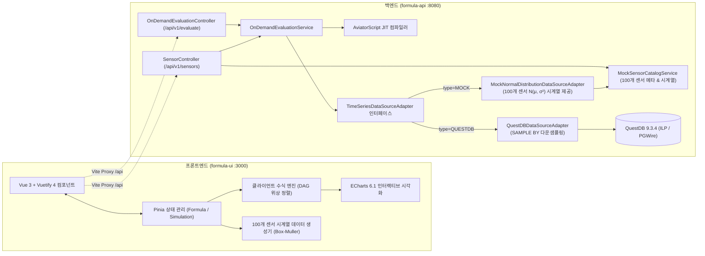
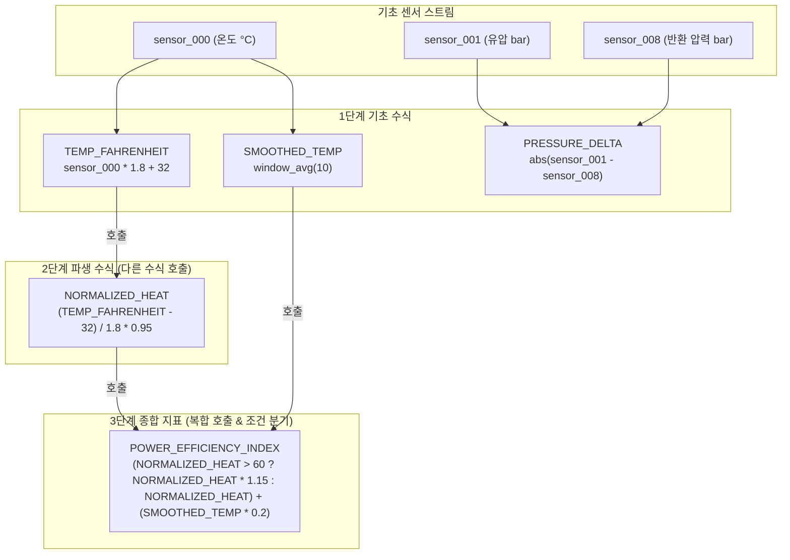
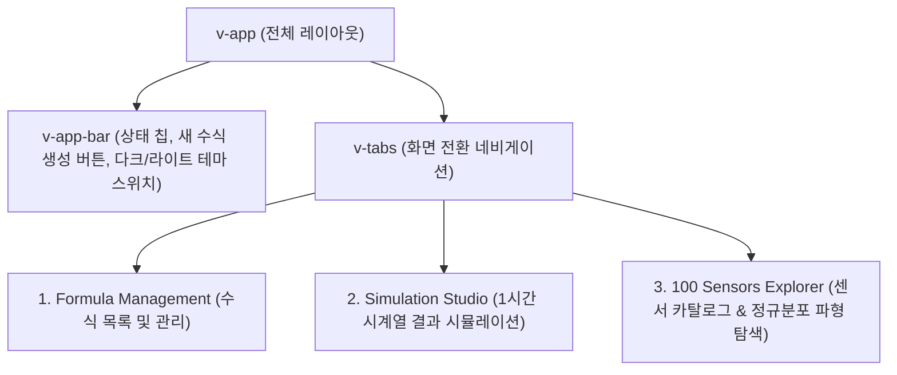
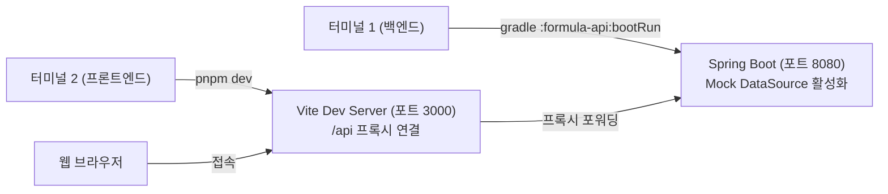

# 📊 Formula UI 사용자 및 아키텍처 가이드 (Frontend UI Guide)

본 문서는 **Formula Evaluator Service**의 온디맨드 요청(On-Demand Path) 기능을 담당하는 프론트엔드 모듈인 **`formula-ui`**의 아키텍처 구성, 핵심 컴포넌트, 수식 작성/호출 메커니즘, 백엔드 서비스 연동 규격, 그리고 프론트엔드-백엔드 동시 실행 및 트러블슈팅 방법을 상세히 설명합니다.

---

## 1. 개요 및 기술 스택

`formula-ui`는 대규모 IoT 설비에서 유입되는 시계열 센서 데이터를 온디맨드로 조회하고, 사용자가 정의한 동적 수식(Formula)과 다중 센서 간 복합 연산 및 윈도우 집계 로직을 인터랙티브하게 검증 및 시뮬레이션할 수 있는 Single Page Application (SPA)입니다.



### 주요 기술 스택
| 구분 | 라이브러리 / 도구 | 버전 | 역할 |
| :--- | :--- | :--- | :--- |
| **Framework** | [Vue.js](https://vuejs.org/) | `3.5.42` | Composition API (`<script setup lang="ts">`) 기반 컴포넌트 개발 |
| **UI Library** | [Vuetify](https://vuetifyjs.com/) | `4.2.4` | Material Design 기반 엔지니어링 테마 대시보드 UI (`v-app`, `v-card`, `v-table`, `v-dialog`) |
| **Icons** | [@mdi/font](https://materialdesignicons.com/) | `7.4.47` | Material Design Vector Icons |
| **Bundler** | [Vite](https://vite.dev/) | `8.3.0` | 초고속 HMR 및 프로덕션 롤다운 빌드, 백엔드 API 리버스 프록시 |
| **State Management**| [Pinia](https://pinia.vuejs.org/) | `4.0.3` | 수식 정의(CRUD) 및 시뮬레이션 실행 상태 전역 관리 |
| **Chart Visualizer**| [Apache ECharts](https://echarts.apache.org/) | `6.1.0` | 3,600초 시계열 인터랙티브 DataZoom 슬라이더 및 멀티 시리즈 렌더링 |
| **Testing** | [Vitest](https://vitest.dev/) / JUnit 5 | `5.0.3` / `5.11` | 수식 엔진, DAG 위상 정렬, 센서 API 통합 단위 테스트 |
| **Package Manager** | [pnpm](https://pnpm.io/) | `12.10.1` | 고속 및 디스크 효율적인 모노레포 패키지 관리 |

---

## 2. 모듈 디렉터리 구조

```
formula-evaluator-service/
├── formula-api/                # Spring Boot 3.5 REST API 백엔드
│   ├── src/main/java/com/imoil/formula/
│   │   ├── api/
│   │   │   ├── OnDemandEvaluationController.java   # GET /api/v1/evaluate
│   │   │   └── SensorController.java               # GET /api/v1/sensors (카탈로그 & 시계열)
│   │   ├── datasource/
│   │   │   ├── DataSourceType.java                 # QUESTDB, RDBMS, STREAMING, MOCK
│   │   │   ├── MockNormalDistributionDataSourceAdapter.java  # 100개 센서 Mock 어댑터
│   │   │   └── QuestDBDataSourceAdapter.java       # QuestDB PGWire 연동 어댑터
│   │   ├── service/
│   │   │   ├── MockSensorCatalogService.java       # 100개 센서 메타데이터 & 시계열 생성 서비스
│   │   │   └── OnDemandEvaluationService.java      # 온디맨드 수식 평가 서비스
│   │   └── config/
│   │       ├── QuestDBConfig.java                  # ILP Sender 및 Fallback Dynamic Proxy 설정
│   │       └── TimeSeriesDataSourceConfig.java     # 어댑터 DI 조건부 빈 구성
├── formula-ui/                 # Vite + Vue 3 + Vuetify 4 프론트엔드
│   ├── src/
│   │   ├── components/
│   │   │   ├── FormulaList.vue          # 작성 수식 목록 보기 및 관리
│   │   │   ├── FormulaEditor.vue        # 수식 작성, 수정 및 실시간 DAG 분석 모달
│   │   │   ├── FormulaSimulation.vue    # 1시간 시계열 결과 시뮬레이션 및 ECharts 차트
│   │   │   └── SensorDataExplorer.vue   # 100개 센서 카탈로그 및 정규분포 파형 탐색기
│   │   ├── services/
│   │   │   ├── formulaEngine.ts         # 토큰 파서, DAG 위상 정렬, 윈도우 함수 JIT 엔진
│   │   │   ├── sensorDataGenerator.ts   # 100개 센서 1초 간격 Box-Muller 시계열 생성기
│   │   │   └── apiClient.ts             # Spring Boot REST API 연동 클라이언트
│   │   ├── stores/
│   │   │   ├── formulaStore.ts          # 수식 정의 CRUD, localStorage 영속화
│   │   │   └── simulationStore.ts       # 시뮬레이션 설정 및 듀얼 엔진 실행 스토어
│   │   ├── test/
│   │   │   ├── formulaEngine.test.ts    # 수식 엔진 및 DAG 위상 정렬 Vitest 단위 테스트
│   │   │   └── formulaStore.test.ts     # Pinia 수식 스토어 CRUD Vitest 단위 테스트
│   │   ├── App.vue                      # 네비게이션 툴바, 탭 라우팅, 다크/라이트 테마
│   │   └── main.ts                      # Vuetify 4 및 Pinia 등록
│   ├── vite.config.ts                   # Vite 8 번들러 및 /api 백엔드 리버스 프록시
│   └── package.json
└── docs/
    └── FRONTEND_UI_GUIDE.md    # 프론트엔드 상세 아키텍처 및 사용자 가이드 (본 문서)
```

---

## 3. 핵심 아키텍처 및 동작 원리

### 3.1 수식 간 호출 메커니즘 (Directed Acyclic Graph & Topological Sorting)

사용자가 작성한 수식은 다른 수식에서 호출되어 다단계 합성 수식(Composite Formula)을 구성할 수 있습니다.



#### 평가 단계별 처리 방식 ([`formulaEngine.ts`](file:///C:/Users/imoil/repo/formula-evaluator-service/formula-ui/src/services/formulaEngine.ts))
1. **토큰 분석 ([`extractReferences`](file:///C:/Users/imoil/repo/formula-evaluator-service/formula-ui/src/services/formulaEngine.ts#L10-L54))**: 수식 텍스트에서 예약어(함수명, 연산자)를 제외한 식별자를 추출하여 `sensor_XXX`와 기등록된 수식 ID(`FORMULA_ID`)를 분류합니다.
2. **순환 참조 감지 (Cycle Detection)**: 깊이 우선 탐색(DFS)을 수행하여 상호 참조(`A -> B -> A`)가 존재하는지 검증하고, 순환 경로가 발견되면 사용자에게 에러를 반환합니다.
3. **위상 정렬 ([`getEvaluationOrder`](file:///C:/Users/imoil/repo/formula-evaluator-service/formula-ui/src/services/formulaEngine.ts#L125-L160))**: 호출되는 하위 수식이 항상 호출하는 상위 수식보다 먼저 평가되도록 실행 순서 배열을 생성합니다. (예: `['TEMP_FAHRENHEIT', 'NORMALIZED_HEAT', 'SMOOTHED_TEMP', 'POWER_EFFICIENCY_INDEX']`)
4. **시간 축 스텝 순회 평가**:
   - 매 초($t$)마다 필요한 센서 원본 값 및 이전 100개 포인트의 슬라이딩 윈도우 버퍼를 구성합니다.
   - 정렬된 순서대로 하위 수식을 평가하여 실행 컨텍스트(`ctx[formulaId] = result`)에 적재합니다.
   - 상위 수식은 컨텍스트에 이미 계산된 하위 수식의 값을 변수처럼 직접 참조하여 최종 값을 도출합니다.

---

### 3.2 듀얼 계산 엔진 (Client JIT vs Backend AviatorScript)

시스템은 온디맨드 시뮬레이션 환경에서 유연성을 극대화하기 위해 클라이언트 JIT 엔진과 백엔드 REST API 엔진을 상호보완적으로 제공합니다.

| 비교 항목 | 클라이언트 JIT 엔진 (`formulaEngine.ts`) | 백엔드 AviatorScript 엔진 (`formula-api`) |
| :--- | :--- | :--- |
| **실행 위치** | 사용자의 웹 브라우저 (JavaScript V8) | Spring Boot 애플리케이션 서버 (JVM) |
| **수식 간 호출** | **완전 지원** (DAG 위상 정렬로 다단계 수식 합성 연산) | 단일 수식 또는 사전 정의된 룰셋 대상 평가 |
| **윈도우 집계** | `window_avg(n)`, `window_max(n)`, `window_min(n)` | QuestDB `SAMPLE BY` 다운샘플링 또는 커스텀 함수 |
| **레이턴시** | **초고속** (3,600개 포인트 연산 약 10~25ms) | 네트워크 왕복 + Aviator 컴파일 (약 30~80ms) |
| **데이터 소스** | 브라우저 인메모리 Box-Muller 시계열 생성기 | Mock DataSource 또는 실제 QuestDB TSDB |
| **적합한 유즈케이스** | 인터랙티브 수식 작성, 실시간 파라미터 튜닝, 복합 DAG 실험 | 대규모 원본 시계열 다운샘플링 검증, 서버 기준 정합성 확인 |

---

### 3.3 백엔드 서비스 연동 및 Mock DataSource 구현

프론트엔드 UI의 온디맨드 기능과 센서 탐색 기능을 완벽하게 지원하기 위해 백엔드([`formula-api`](file:///C:/Users/imoil/repo/formula-evaluator-service/formula-api))에 다음 어댑터와 REST 컨트롤러가 구현되어 있습니다.

#### ① 백엔드 Mock DataSource ([`MockNormalDistributionDataSourceAdapter.java`](file:///C:/Users/imoil/repo/formula-evaluator-service/formula-api/src/main/java/com/imoil/formula/datasource/MockNormalDistributionDataSourceAdapter.java))
* **역할**: QuestDB 또는 Kafka 인프라가 없는 로컬 개발/테스트 환경에서도 100개 센서(`sensor_000` ~ `sensor_099`)의 1시간(3,600초) 분량 정규분포 시계열 데이터를 백엔드에서 생성하여 반환합니다.
* **데이터 소스 전환**: `formula-api/src/main/resources/application.yml`의 `evaluation.datasource.type` 설정을 통해 전환 가능합니다:
  ```yaml
  evaluation:
    datasource:
      type: MOCK # 또는 QUESTDB, RDBMS, STREAMING
  ```
  - `MOCK` 설정 시: 인프라 종속성 없이 백엔드 단독 실행 및 온디맨드 수식 평가 완전 지원.
  - `QUESTDB` 설정 시: 실제 QuestDB TSDB의 PGWire SQL과 `SAMPLE BY` 다운샘플링 쿼리 수행.
* **외부 인프라 No-Op Fallback Sender 메커니즘**:
  - `QuestDBConfig.java`에 **Dynamic Proxy 기반 No-Op Fallback Sender**가 내장되어 있습니다.
  - 외부 QuestDB ILP 포트(`9000`)에 접속할 수 없더라도 `LineSenderException` 예외로 인해 스프링 컨텍스트 부팅이 실패하지 않도록 자동 감지 후 No-Op Proxy 객체로 우회합니다.
  - 따라서 개발자는 Docker나 Podman을 켜지 않고도 바로 백엔드를 단독 실행할 수 있습니다.

#### ② 백엔드 REST 엔드포인트 명세
| HTTP Method | 엔드포인트 | 설명 | 파라미터 |
| :--- | :--- | :--- | :--- |
| `GET` | `/api/v1/evaluate` | 온디맨드 동적 수식 평가 실행 | `sensorId`, `expression`, `startTime`, `endTime`, `sampleBy` |
| `GET` | `/api/v1/sensors` | 100개 가상 센서 카탈로그 메타데이터 반환 | 없음 |
| `GET` | `/api/v1/sensors/{sensorId}` | 특정 센서 메타데이터(평균, 편차, 단위) 반환 | `sensorId` (경로 변수) |
| `GET` | `/api/v1/sensors/{sensorId}/timeseries` | 특정 센서의 1시간(3,600건) 원본 시계열 반환 | `sensorId`, `sampleBy` (기본값: 1s) |

#### ③ REST API JSON 요청 및 응답 포맷 예시

##### 1) 센서 카탈로그 조회 (`GET /api/v1/sensors`)
```json
[
  {
    "id": "sensor_000",
    "name": "sensor_000 (Temperature)",
    "category": "Temperature",
    "unit": "°C",
    "mean": 52.3,
    "standardDeviation": 2.1,
    "description": "Virtual sensor sensor_000 generated with normal distribution"
  },
  {
    "id": "sensor_001",
    "name": "sensor_001 (Pressure)",
    "category": "Pressure",
    "unit": "bar",
    "mean": 105.7,
    "standardDeviation": 4.5,
    "description": "Virtual sensor sensor_001 generated with normal distribution"
  }
]
```

##### 2) 센서 시계열 조회 (`GET /api/v1/sensors/sensor_000/timeseries?sampleBy=1s`)
```json
[
  {
    "sensorId": "sensor_000",
    "timestamp": 1710000000000,
    "value": 53.12,
    "state": 0,
    "hasInaccurateData": false
  },
  {
    "sensorId": "sensor_000",
    "timestamp": 1710000001000,
    "value": 51.84,
    "state": 0,
    "hasInaccurateData": false
  }
]
```

##### 3) 온디맨드 수식 평가 (`GET /api/v1/evaluate?sensorId=sensor_000&expression=value*1.8%2B32&startTime=2026-10-09T20:00:00Z&endTime=2026-10-09T21:00:00Z`)
```json
[
  {
    "sensorId": "sensor_000_ondemand_eval",
    "timestamp": 1710000000000,
    "value": 127.616,
    "state": 0,
    "hasInaccurateData": false
  },
  {
    "sensorId": "sensor_000_ondemand_eval",
    "timestamp": 1710000001000,
    "value": 125.312,
    "state": 0,
    "hasInaccurateData": false
  }
]
```

---

### 3.4 샘플 센서 데이터 생성기 (Box-Muller 정규분포 시계열)

온디맨드 시뮬레이션의 신뢰성 높은 검증을 위해 100개의 가상 센서 데이터를 생성합니다.

* **센서 식별자**: `sensor_000` ~ `sensor_099` (총 100개)
* **발생 주기**: 1초당 1회 ($1\text{ Hz}$)
* **데이터 범위**: 1시간 분량 ($3,600\text{초} \times 100\text{개} = 360,000\text{건}$)
* **수학적 모델**: 균등 난수 $U_1, U_2 \in (0, 1)$를 이용한 **Box-Muller 변환**:
  $$Z = \mu + \sigma \sqrt{-2 \ln(U_1)} \cos(2\pi U_2)$$
* **현실적인 물리 파라미터 구성**:

| 센서 카테고리 | 대표 센서 ID 예시 | 평균 ($\mu$) | 표준편차 ($\sigma$) | 단위 | 물리적 의미 |
| :--- | :--- | :--- | :--- | :--- | :--- |
| **Temperature** | `sensor_000` | $45 \sim 110$ | $1.5 \sim 5.5$ | °C | 베어링, 배기 매니폴드, 냉각수 온도 |
| **Pressure** | `sensor_001` | $20 \sim 180$ | $1.0 \sim 7.2$ | bar | 유압 펌프 토출압, 라인 흡입압 |
| **Vibration** | `sensor_002` | $2.5 \sim 28$ | $0.4 \sim 3.4$ | mm/s | X/Y/Z 축 진동 가속도 및 충격치 |
| **Electrical** | `sensor_003` | $210 \sim 480$ | $3.0 \sim 9.6$ | V | 전원 계통 3상 전압 및 부하 모니터링 |
| **Flow** | `sensor_004` | $15 \sim 95$ | $0.9 \sim 5.7$ | L/min | 냉각 유체 및 윤활유 순환 유량 |
| **Mechanical** | `sensor_005` | $900 \sim 3200$ | $27 \sim 96$ | RPM | 모터 주축 및 터빈 회전수 |
| **Environmental**| `sensor_006` | $35 \sim 75$ | $1.8 \sim 3.8$ | % | 설비 챔버 내부 상대 습도 |

---

## 4. UI 화면별 상세 사용 방법



### 화면 1: 수식 관리 ([`FormulaList.vue`](file:///C:/Users/imoil/repo/formula-evaluator-service/formula-ui/src/components/FormulaList.vue))
* **검색 & 카테고리 필터**: 수식 식별자, 이름, 수식 텍스트 검색 및 카테고리별 칩 필터링.
* **호출 관계 시각화**:
  - `Calls`: 본 수식이 호출하는 하위 수식 목록
  - `Sensors`: 참조 중인 IoT 센서 목록
  - `Used by`: 본 수식을 호출하고 있는 상위 합성 수식 목록
* **액션**: [Simulate] 원클릭 시뮬레이터 이동, [수정], [복제], [삭제(참조 중인 경우 안전 차단)], [JSON 백업/복원].

### 화면 2: 수식 작성/편집기 모달 ([`FormulaEditor.vue`](file:///C:/Users/imoil/repo/formula-evaluator-service/formula-ui/src/components/FormulaEditor.vue))
* **Formula ID**: 다른 수식에서 호출할 변수 식별자 입력 (영문 대문자, 밑줄).
* **퀵 인서트 툴바**: 기작성된 하위 수식, 100개 센서, 윈도우 집계 함수(`window_avg(10)`), 수학 함수, 삼항 연산자 간편 삽입.
* **실시간 DAG 분석 & Dry Run**: 실시간 구문 분석 및 `t=0` 시점 가상 센서 대입 즉석 테스트.

### 화면 3: 시뮬레이션 스튜디오 ([`FormulaSimulation.vue`](file:///C:/Users/imoil/repo/formula-evaluator-service/formula-ui/src/components/FormulaSimulation.vue))
* **제어 바**: 대상 수식 선택, 기준 센서 선택, 시뮬레이션 기간(1시간, 30분, 15분, 5분), 해상도(1초, 5초, 10초, 60초).
* **듀얼 엔진 스위치**:
  - `OFF` (Client Engine): 브라우저 고속 JIT 엔진으로 즉시 연산 (10~25ms).
  - `ON` (Backend REST API): Spring Boot `/api/v1/evaluate` 호출.
* **ECharts 인터랙티브 차트**:
  - 결과 곡선 + 원본 센서 곡선 + 하위 수식 중간 곡선 동시 렌더링.
  - 하단 **DataZoom 슬라이더**를 통해 3,600초 구간을 자유롭게 드래그/줌인/팬 탐색.
* **KPI 카드 & CSV 내보내기**: 포인트 수, 평가 레이턴시, 평균값, 최저/최고값, 표준편차 요약 및 `.csv` 다운로드.

### 화면 4: 100개 센서 카탈로그 ([`SensorDataExplorer.vue`](file:///C:/Users/imoil/repo/formula-evaluator-service/formula-ui/src/components/SensorDataExplorer.vue))
* 100개 센서 카탈로그 테이블 및 우측 카드 실시간 파형 프리뷰 ECharts 라인 차트 제공.
* [Simulate] 버튼 클릭 시 해당 센서를 입력값으로 바인딩하여 시뮬레이션 화면으로 전환.

---

## 5. 수식 작성 문법 및 지원 함수 레퍼런스

| 구분 | 함수 / 연산자 | 설명 | 예시 |
| :--- | :--- | :--- | :--- |
| **사칙연산** | `+`, `-`, `*`, `/`, `%` | 기본 산술 및 모듈로 | `sensor_001 * 1.5 + 20` |
| **비교/논리**| `>`, `<`, `==`, `!=`, `&&`, `\|\|` | 대소 비교 및 조건 결합 | `sensor_001 > 50 && sensor_002 < 10` |
| **삼항식** | `condition ? A : B` | 조건에 따른 분기 계산 | `sensor_004 > 80 ? sensor_004 * 1.2 : sensor_004` |
| **윈도우** | `window_avg(n)` | 최근 $n$초간 이동 평균 | `window_avg(10)` |
| **윈도우** | `window_max(n)`, `window_min(n)`| 최근 $n$초간 최댓값 / 최솟값 | `window_max(30)` |
| **수학** | `abs(x)`, `sqrt(x)` | 절댓값 및 제곱근 | `abs(sensor_001 - sensor_008)` |
| **수학** | `round`, `floor`, `ceil` | 반올림 / 내림 / 올림 | `round(sensor_000)` |
| **수식 호출**| `FORMULA_ID` | 다른 기등록 수식 호출 | `(TEMP_FAHRENHEIT - 32) / 1.8` |

---

## 6. 개발 및 동시 실행 가이드 (Frontend + Backend Startup)

프론트엔드 UI와 백엔드 서비스를 함께 실행하는 두 가지 방식을 안내합니다.

### 6.1 모드 A: 로컬 Standalone Mock 모드 (권장: 외부 인프라 불필요)
Docker나 외부 데이터베이스(QuestDB/Kafka) 설치 없이, 백엔드의 `MockNormalDistributionDataSourceAdapter`와 프론트엔드를 구동하는 가장 간편하고 빠른 개발 방식입니다.



#### OS별 터미널 실행 명령어:

##### [1단계] 터미널 1: Spring Boot 백엔드 실행 (MOCK 프로파일)
```powershell
# Windows PowerShell 환경:
# 큰따옴표 또는 작은따옴표를 명확히 감싸서 인자를 전달합니다.
gradle :formula-api:bootRun --args="--evaluation.datasource.type=MOCK"
# 또는 gradlew 래퍼 사용 시:
.\gradlew.bat :formula-api:bootRun --args="--evaluation.datasource.type=MOCK"
```

```bash
# Linux / macOS Bash 환경:
./gradlew :formula-api:bootRun --args='--evaluation.datasource.type=MOCK'
# 또는
gradle :formula-api:bootRun --args='--evaluation.datasource.type=MOCK'
```

```cmd
:: Windows CMD 환경:
gradlew.bat :formula-api:bootRun --args="--evaluation.datasource.type=MOCK"
```

💡 **환경 변수를 통한 간편 실행**:
커맨드라인 인자 구문이 번거로운 경우 환경 변수를 사용할 수도 있습니다:
* **PowerShell**: `$env:EVALUATION_DATASOURCE_TYPE="MOCK"; gradle :formula-api:bootRun`
* **Bash**: `EVALUATION_DATASOURCE_TYPE=MOCK ./gradlew :formula-api:bootRun`
* 정상 기동 시 콘솔에 다음과 같은 로그가 출력됩니다:
  ```
  INFO ... TimeSeriesDataSourceConfig : Configuring TimeSeriesDataSourceAdapter as [MOCK (Normal Distribution Generated InMemory Data)]
  INFO ... o.s.b.w.embedded.tomcat.TomcatWebServer  : Tomcat started on port 8080 (http) with context path '/'
  ```

##### [2단계] 터미널 2: Vue 3 프론트엔드 UI 실행
```bash
cd formula-ui
pnpm install
pnpm dev
```
💡 정상 기동 시 콘솔에 `Local: http://localhost:3000/`가 출력됩니다.

##### [3단계] 브라우저 접속
브라우저에서 `http://localhost:3000`에 접속합니다.

---

### 6.2 모드 B: 전체 인프라 연동 엔터프라이즈 모드 (QuestDB + Kafka 포함)
실제 QuestDB TSDB와 Kafka 브로커를 컨테이너로 구동하고, 백엔드가 실제 QuestDB에 질의하는 완전한 엔드투엔드 파이프라인 모드입니다.

#### 실행 단계:
```bash
# [1단계] 컨테이너 인프라 기동 (QuestDB & Kafka)
podman-compose up -d
# (또는 docker compose -f podman-compose.yml up -d)

# [2단계] Spring Boot 백엔드 기동 (기본값: QUESTDB 어댑터 활성화)
gradle :formula-api:bootRun

# [3단계] Flink 스트리밍 잡 기동 (실시간 센서 룰 전파 시)
flink run -c com.imoil.formula.flink.StreamingEvaluatorJob formula-flink/build/libs/formula-flink-0.0.1-SNAPSHOT.jar

# [4단계] 프론트엔드 UI 기동
cd formula-ui
pnpm dev
```

---

### 6.3 프론트엔드 프로덕션 빌드 (Production Build)

정적 자산을 프로덕션 환경에 배포하려면 아래 빌드 명령을 수행합니다:

```bash
cd formula-ui
pnpm build
```

* `vue-tsc -b && vite build`가 실행되며 타입 체크와 롤다운 최적화가 수행됩니다.
* 빌드 결과물은 `formula-ui/dist/` 디렉터리에 생성됩니다.
* 산출물은 Nginx, AWS S3/CloudFront 또는 Spring Boot의 정적 리소스 경로(`formula-api/src/main/resources/static/`)에 배치하여 서빙할 수 있습니다.

---

### 6.4 단위 테스트 검증
```bash
# 백엔드 단위 테스트 (SensorController & MockAdapter 포함)
gradle :formula-api:test

# 프론트엔드 단위 테스트 (수식 엔진, DAG 위상 정렬, Pinia 스토어)
cd formula-ui
pnpm test
```

---

### 6.5 실시간 E2E HTTP 통합 검증 가이드
백엔드(`localhost:8080`)와 프론트엔드(`localhost:3000`)가 기동된 상태에서 다음 명령어로 동작을 직접 확인할 수 있습니다.

```bash
# 1. 백엔드 직접 호출: 100개 센서 카탈로그 확인
curl http://localhost:8080/api/v1/sensors

# 2. 백엔드 직접 호출: 특정 센서 메타데이터 확인
curl http://localhost:8080/api/v1/sensors/sensor_000

# 3. 백엔드 직접 호출: 온디맨드 수식 계산 결과 확인 (화씨 변환 예시)
curl "http://localhost:8080/api/v1/evaluate?sensorId=sensor_000&expression=value*1.8%2B32&startTime=2026-10-09T20:00:00Z&endTime=2026-10-09T21:00:00Z"

# 4. 프론트엔드 Vite 프록시 경유 호출: 포트 3000 -> 포트 8080 포워딩 확인
curl http://localhost:3000/api/v1/sensors

# 5. 프론트엔드 Vite 프록시 경유 호출: 온디맨드 수식 계산 확인
curl "http://localhost:3000/api/v1/evaluate?sensorId=sensor_001&expression=value%2B100&startTime=2026-10-09T20:00:00Z&endTime=2026-10-09T21:00:00Z"
```

---

## 7. 트러블슈팅 및 기술 FAQ (Troubleshooting & Architecture Details)

### Q1. QuestDB나 Kafka 인프라가 없어도 백엔드가 정상 기동되나요?
**네, 완전히 독립적으로 기동됩니다.**
1. `MockNormalDistributionDataSourceAdapter`는 메모리 기반으로 100개 센서와 3,600개 시계열 포인트를 생성하므로 데이터베이스 연결이 필요 없습니다.
2. `QuestDBConfig`에 **Dynamic Proxy 기반의 No-Op Fallback Sender**가 탑재되어 있어, QuestDB 포트(`9000`)에 연결할 수 없더라도 예외를 발생시키지 않고 안전하게 더미 객체로 우회합니다.
3. 실행 인자로 `--evaluation.datasource.type=MOCK`을 전달하면 단독 실행이 보장됩니다.

### Q2. 프론트엔드와 백엔드 간 포트 차이로 CORS 오류가 발생하지 않나요?
**CORS 오류가 발생하지 않도록 이중 안전장치가 마련되어 있습니다.**
1. **개발 환경**: `formula-ui/vite.config.ts`에 리버스 프록시가 구성되어 있어 브라우저는 포트 `3000`의 `/api`로 요청하고, Vite가 백엔드 `http://localhost:8080`으로 중계합니다.
2. **백엔드 설정**: `OnDemandEvaluationController`와 `SensorController`에 `@CrossOrigin(origins = "*")`이 지정되어 있어, 프록시를 통하지 않고 `8080` 포트로 직접 요청하더라도 브라우저에서 차단되지 않습니다.

### Q3. 백엔드에서 2개의 TimeSeriesDataSourceAdapter 충돌 오류가 발생할 때는?
`OnDemandEvaluationService`는 단일 `TimeSeriesDataSourceAdapter` 빈을 주입받아야 합니다.
* `MockSensorCatalogService`가 메타데이터 및 시계열 생성의 핵심 비즈니스 로직을 담당하는 `@Service`로 분리되었으며,
* `MockNormalDistributionDataSourceAdapter`는 순수 어댑터로서 `TimeSeriesDataSourceConfig`의 `@ConditionalOnProperty(havingValue = "MOCK")` 조건에 의해서만 등록되므로, 빈 중복 충돌 없이 단 하나의 어댑터만 주입됩니다.

### Q4. Windows PowerShell에서 `bootRun --args` 실행 시 따옴표 오류가 날 때는?
PowerShell에서는 따옴표 해석 규칙이 Bash와 다릅니다.
* 권장 형식: `gradle :formula-api:bootRun --args="--evaluation.datasource.type=MOCK"` (큰따옴표 사용)
* 또는 환경 변수 지정: `$env:EVALUATION_DATASOURCE_TYPE="MOCK"; gradle :formula-api:bootRun`
* 또는 `formula-api/src/main/resources/application.yml`의 `evaluation.datasource.type` 값을 `MOCK`으로 변경 후 `gradle :formula-api:bootRun` 실행.
