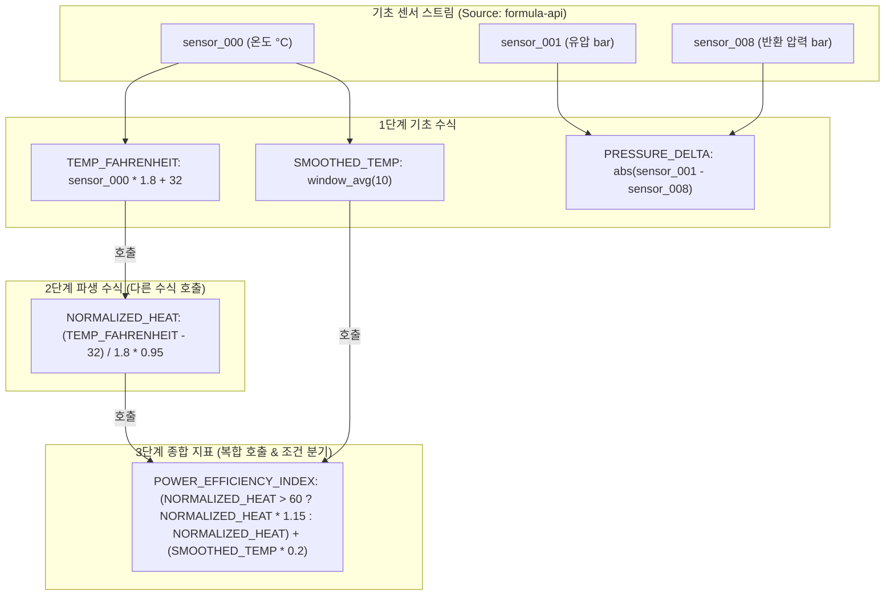
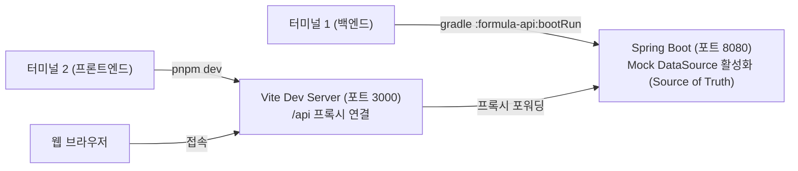

# 📊 Formula UI 사용자 및 아키텍처 가이드 (Frontend UI Guide)

본 문서는 **Formula Evaluator Service**의 온디맨드 요청(On-Demand Path) 기능을 담당하는 프론트엔드 모듈인 **`formula-ui`**의 아키텍처 구성, 핵심 컴포넌트, 수식 작성/호출 메커니즘, 백엔드 서비스 연동 규격, 그리고 프론트엔드-백엔드 동시 실행 및 트러블슈팅 방법을 상세히 설명합니다.

---

## 1. 개요 및 기술 스택

`formula-ui`는 대규모 IoT 설비에서 유입되는 시계열 센서 데이터를 온디맨드로 조회하고, 사용자가 정의한 동적 수식(Formula)과 다중 센서 간 복합 연산 및 윈도우 집계 로직을 인터랙티브하게 검증 및 시뮬레이션할 수 있는 Single Page Application (SPA)입니다.

### 🏛️ 시스템 데이터 파이프라인 아키텍처

> [!IMPORTANT]
> **센서 데이터 단일 진실 공급원 (Single Source of Truth)**:
> 100개 센서 메타데이터 및 1시간 정규분포 시계열 데이터의 원천은 **백엔드 서비스인 `formula-api`의 Mock DataSource(`MockSensorCatalogService`)**입니다.
> 프론트엔드(`formula-ui`)는 자체 생성 대신 백엔드 REST API(`GET /api/v1/sensors`, `GET /api/v1/sensors/{sensorId}/timeseries`)를 호출하여 시뮬레이터 및 차트에 스트리밍하며, 백엔드 미응답 시에만 오프라인 Fallback 생성기가 동작합니다.

```mermaid
flowchart LR
    subgraph ClientLayer["프론트엔드 (formula-ui :3000)"]
        direction TB
        UI["Vue 3 + Vuetify 4 컴포넌트"]
        Stores["Pinia 상태 관리 (Formula / Sensor / Simulation)"]
        Engine["클라이언트 수식 엔진 (DAG 위상 정렬)"]
        Visualizer["ECharts 6.1 인터랙티브 시각화"]
        FallbackGen["오프라인 로컬 Fallback 생성기 (미연결 시 한정)"]

        UI <--> Stores
        Stores --> Engine
        Stores -.->|미연결 시| FallbackGen
        Engine --> Visualizer
    end

    subgraph BackendLayer["백엔드 (formula-api :8080) - Source of Truth"]
        direction TB
        Controller1["OnDemandEvaluationController (/api/v1/evaluate)"]
        Controller2["SensorController (/api/v1/sensors)"]
        Service["OnDemandEvaluationService"]
        Catalog["MockSensorCatalogService (100개 센서 메타데이터 & 1시간 정규분포 원천)"]
        Aviator["AviatorScript JIT 컴파일러"]
        AdapterSelector["TimeSeriesDataSourceAdapter 인터페이스"]
        
        MockAdapter["MockNormalDistributionDataSourceAdapter (100개 센서 N(μ, σ²) 시계열 제공)"]
        QuestDBAdapter["QuestDBDataSourceAdapter (SAMPLE BY 다운샘플링)"]
        QuestDB[("QuestDB 9.3.4 (ILP / PGWire)")]

        Controller1 & Controller2 --> Service
        Controller2 --> Catalog
        Service --> Aviator
        Service --> AdapterSelector
        AdapterSelector -->|type=MOCK| MockAdapter
        MockAdapter --> Catalog
        AdapterSelector -->|type=QUESTDB| QuestDBAdapter
        QuestDBAdapter --> QuestDB
    end

    Stores ==>|1. 센서 카탈로그 & 시계열 조회 (기본)| Controller2
    UI -.->|2. 서버 수식 평가 (/api/v1/evaluate)| Controller1
```

### 주요 기술 스택
| 구분 | 라이브러리 / 도구 | 버전 | 역할 |
| :--- | :--- | :--- | :--- |
| **Framework** | [Vue.js](https://vuejs.org/) | `3.5.42` | Composition API (`<script setup lang="ts">`) 기반 컴포넌트 개발 |
| **UI Library** | [Vuetify](https://vuetifyjs.com/) | `4.2.4` | Material Design 기반 엔지니어링 테마 대시보드 UI (`v-app`, `v-card`, `v-table`, `v-dialog`) |
| **Icons** | [@mdi/font](https://materialdesignicons.com/) | `7.4.47` | Material Design Vector Icons (`mdi` 아이콘셋 바인딩) |
| **Bundler** | [Vite](https://vite.dev/) | `8.3.0` | 초고속 HMR 및 프로덕션 롤다운 빌드, 백엔드 API 리버스 프록시 |
| **State Management**| [Pinia](https://pinia.vuejs.org/) | `4.0.3` | 수식 정의(`formulaStore`), 백엔드 센서 연동(`sensorStore`), 시뮬레이션 실행(`simulationStore`) |
| **Chart Visualizer**| [Apache ECharts](https://echarts.apache.org/) | `6.1.0` | 3,600초 시계열 인터랙티브 DataZoom 슬라이더 및 멀티 시리즈 렌더링 |
| **Testing** | [Vitest](https://vitest.dev/) / JUnit 5 | `5.0.3` / `5.11` | 수식 엔진, DAG 위상 정렬, 센서 API 통합 단위 테스트 |
| **Package Manager** | [pnpm](https://pnpm.io/) | `12.10.1` | 고속 및 디스크 효율적인 모노레포 패키지 관리 |

---

## 2. 모듈 디렉터리 구조

```
formula-evaluator-service/
├── formula-api/                # Spring Boot 3.5 REST API 백엔드 (Source of Truth)
│   ├── src/main/java/com/imoil/formula/
│   │   ├── api/
│   │   │   ├── OnDemandEvaluationController.java   # GET /api/v1/evaluate
│   │   │   └── SensorController.java               # GET /api/v1/sensors (카탈로그 & 시계열 원천)
│   │   ├── datasource/
│   │   │   ├── DataSourceType.java                 # QUESTDB, RDBMS, STREAMING, MOCK
│   │   │   ├── MockNormalDistributionDataSourceAdapter.java  # 100개 센서 Mock 어댑터
│   │   │   └── QuestDBDataSourceAdapter.java       # QuestDB PGWire 연동 어댑터
│   │   ├── service/
│   │   │   ├── MockSensorCatalogService.java       # 100개 센서 메타 & 시계열 원천 생성 서비스
│   │   │   └── OnDemandEvaluationService.java      # 온디맨드 수식 평가 서비스
│   │   └── config/
│   │       ├── QuestDBConfig.java                  # Fallback Dynamic Proxy 설정
│   │       └── TimeSeriesDataSourceConfig.java     # 어댑터 DI 조건부 빈 구성
├── formula-ui/                 # Vite + Vue 3 + Vuetify 4 프론트엔드
│   ├── src/
│   │   ├── components/
│   │   │   ├── FormulaList.vue          # 작성 수식 목록 보기 및 관리
│   │   │   ├── FormulaEditor.vue        # 수식 작성, 수정 및 실시간 DAG 분석 모달
│   │   │   ├── FormulaSimulation.vue    # 1시간 시계열 결과 시뮬레이션 및 ECharts 차트
│   │   │   └── SensorDataExplorer.vue   # 백엔드 연동 100개 센서 카탈로그 및 파형 탐색기
│   │   ├── services/
│   │   │   ├── formulaEngine.ts         # 토큰 파서, DAG 위상 정렬, 윈도우 함수 JIT 엔진
│   │   │   ├── apiClient.ts             # Spring Boot REST API 연동 클라이언트
│   │   │   └── sensorDataGenerator.ts   # [오프라인/테스트 Fallback] 로컬 시계열 생성기
│   │   ├── stores/
│   │   │   ├── formulaStore.ts          # 수식 정의 CRUD, localStorage 영속화
│   │   │   ├── sensorStore.ts           # 백엔드 formula-api 센서 카탈로그 및 시계열 스토어
│   │   │   └── simulationStore.ts       # 백엔드 센서 스트림 기반 시뮬레이션 조정자
│   │   ├── test/
│   │   │   ├── formulaEngine.test.ts    # 수식 엔진 및 DAG 위상 정렬 Vitest 단위 테스트
│   │   │   └── formulaStore.test.ts     # Pinia 수식 스토어 CRUD Vitest 단위 테스트
│   │   ├── App.vue                      # 네비게이션 툴바, 탭 라우팅, 서버 온라인 상태 뱃지
│   │   └── main.ts                      # Vuetify 4 및 MDI Iconset 등록
│   ├── vite.config.ts                   # Vite 8 번들러 및 /api 백엔드 리버스 프록시
│   └── package.json
└── docs/
    └── FRONTEND_UI_GUIDE.md    # 프론트엔드 상세 아키텍처 및 사용자 가이드 (본 문서)
```

---

## 3. 핵심 아키텍처 및 동작 원리

### 3.1 수식 간 호출 메커니즘 (Directed Acyclic Graph & Topological Sorting)

사용자가 작성한 수식은 다른 수식에서 호출되어 다단계 합성 수식(Composite Formula)을 구성할 수 있습니다.



#### 평가 단계별 처리 방식 ([`formulaEngine.ts`](file:///C:/Users/imoil/repo/formula-evaluator-service/formula-ui/src/services/formulaEngine.ts))
1. **토큰 분석 ([`extractReferences`](file:///C:/Users/imoil/repo/formula-evaluator-service/formula-ui/src/services/formulaEngine.ts#L10-L54))**: 수식 텍스트에서 예약어를 제외한 식별자를 추출하여 `sensor_XXX`와 기등록된 수식 ID(`FORMULA_ID`)를 분류합니다.
2. **순환 참조 감지 (Cycle Detection)**: 깊이 우선 탐색(DFS)을 수행하여 상호 참조(`A -> B -> A`)가 존재하는지 검증합니다.
3. **위상 정렬 ([`getEvaluationOrder`](file:///C:/Users/imoil/repo/formula-evaluator-service/formula-ui/src/services/formulaEngine.ts#L140-L190))**: 하위 수식이 상위 수식보다 항상 먼저 계산되도록 실행 순서 배열을 생성합니다.
4. **백엔드 센서 시계열 주입**:
   - `getRequiredSensors(...)`를 통해 DAG 전체에서 참조되는 센서 목록을 추출합니다.
   - `sensorStore.fetchTimeSeries(sensorId)`를 통해 **백엔드 `formula-api`에서 실제 1시간 시계열 데이터를 패치**하여 엔진에 주입합니다.
   - 매 초($t$)마다 하위 수식부터 차례로 평가하여 실행 컨텍스트에 적재하고, 상위 수식이 이를 참조하여 최종 산출물을 완성합니다.

---

### 3.2 듀얼 계산 엔진 (Client JIT vs Backend AviatorScript)

| 비교 항목 | 클라이언트 JIT 엔진 (`formulaEngine.ts`) | 백엔드 AviatorScript 엔진 (`formula-api`) |
| :--- | :--- | :--- |
| **실행 위치** | 사용자의 웹 브라우저 (JavaScript V8) | Spring Boot 애플리케이션 서버 (JVM) |
| **수식 간 호출** | **완전 지원** (DAG 위상 정렬로 다단계 수식 합성 연산) | 단일 수식 또는 사전 정의된 룰셋 대상 평가 |
| **윈도우 집계** | `window_avg(n)`, `window_max(n)`, `window_min(n)` | QuestDB `SAMPLE BY` 다운샘플링 또는 커스텀 함수 |
| **레이턴시** | **초고속** (3,600개 포인트 연산 약 10~25ms) | 네트워크 왕복 + Aviator 컴파일 (약 30~80ms) |
| **센서 데이터 소스** | **`formula-api` Mock REST API** (오프라인 시 Fallback) | `MockNormalDistributionDataSourceAdapter` 또는 QuestDB |
| **적합한 유즈케이스** | 인터랙티브 수식 작성, 실시간 파라미터 튜닝, 복합 DAG 실험 | 대규모 원본 시계열 다운샘플링 검증, 서버 기준 정합성 확인 |

---

### 3.3 백엔드 서비스 연동 및 Mock DataSource 구현 (Single Source of Truth)

#### ① 백엔드 Mock DataSource ([`MockSensorCatalogService.java`](file:///C:/Users/imoil/repo/formula-evaluator-service/formula-api/src/main/java/com/imoil/formula/service/MockSensorCatalogService.java))
* **단일 진실 공급원**: 100개 센서(`sensor_000` ~ `sensor_099`)의 메타데이터와 1시간(3,600초) 분량의 정규분포 시계열 데이터 원천은 백엔드의 `MockSensorCatalogService`가 유일하게 관리합니다.
* **데이터 소스 전환**: `formula-api/src/main/resources/application.yml`의 `evaluation.datasource.type` 설정을 통해 전환 가능합니다:
  ```yaml
  evaluation:
    datasource:
      type: MOCK # 또는 QUESTDB, RDBMS, STREAMING
  ```
  - `MOCK` 설정 시: 인프라 종속성 없이 백엔드 단독 실행 및 온디맨드 수식 평가 완전 지원.
  - `QUESTDB` 설정 시: 실제 QuestDB TSDB의 PGWire SQL과 `SAMPLE BY` 다운샘플링 쿼리 수행.
* **외부 인프라 No-Op Fallback Sender 메커니즘**:
  - `QuestDBConfig.java`에 **Dynamic Proxy 기반 No-Op Fallback Sender**가 탑재되어 있어 외부 QuestDB 포트(`9000`)에 접속할 수 없더라도 부팅 실패 없이 정상 기동됩니다.

#### ② 백엔드 REST 엔드포인트 명세
| HTTP Method | 엔드포인트 | 설명 | 파라미터 |
| :--- | :--- | :--- | :--- |
| `GET` | `/api/v1/evaluate` | 온디맨드 동적 수식 평가 실행 | `sensorId`, `expression`, `startTime`, `endTime`, `sampleBy` |
| `GET` | `/api/v1/sensors` | 100개 가상 센서 카탈로그 메타데이터 반환 | 없음 |
| `GET` | `/api/v1/sensors/{sensorId}` | 특정 센서 메타데이터(평균, 편차, 단위) 반환 | `sensorId` (경로 변수) |
| `GET` | `/api/v1/sensors/{sensorId}/timeseries` | 특정 센서의 1시간(3,600건) 원본 시계열 반환 | `sensorId`, `sampleBy` (기본값: 1s) |

#### ③ REST API JSON 요청 및 응답 포맷 예시

##### 1) 센서 카탈로그 조회 (`GET /api/v1/sensors`)
```json
[
  {
    "id": "sensor_000",
    "name": "Temperature Sensor #000",
    "category": "Temperature",
    "unit": "°C",
    "mean": 52.3,
    "stdDev": 2.1,
    "description": "High-frequency IoT temperature telemetry with N(52.3, 2.1²)"
  }
]
```

##### 2) 센서 시계열 조회 (`GET /api/v1/sensors/sensor_000/timeseries?sampleBy=1s`)
```json
[
  {
    "sensorId": "sensor_000",
    "timestamp": 1791576000000,
    "value": 53.12,
    "state": 0,
    "hasInaccurateData": false
  },
  {
    "sensorId": "sensor_000",
    "timestamp": 1791576001000,
    "value": 51.84,
    "state": 0,
    "hasInaccurateData": false
  }
]
```

##### 3) 온디맨드 수식 평가 (`GET /api/v1/evaluate?sensorId=sensor_000&expression=value*1.8%2B32&startTime=2026-10-09T20:00:00Z&endTime=2026-10-09T21:00:00Z`)
```json
[
  {
    "sensorId": "sensor_000_ondemand_eval",
    "timestamp": 1791576000000,
    "value": 127.616,
    "state": 0,
    "hasInaccurateData": false
  }
]
```

---

### 3.4 엔드투엔드 데이터 파이프라인 및 모듈 간 관계도 (Data Pipeline & Sequence)

사용자가 화면에서 시뮬레이션을 실행했을 때, 백엔드 API로부터 센서 데이터를 요청하여 수식 계산 엔진에 주입하고, 최종 계산 결과를 추출하여 ECharts 차트에 시각화하기까지의 전체 모듈 간 상호작용 및 파이프라인입니다.

#### ① 모듈 간 상호작용 및 데이터 흐름도 (Component & Module Interaction Flowchart)

```mermaid
flowchart TD
    User(["사용자 (UI 조작)"])

    subgraph PresentationLayer["1. 프레젠테이션 레이어 (View)"]
        ViewComp["FormulaSimulation.vue (시뮬레이션 스튜디오 화면)"]
        ChartComp["Apache ECharts 6.1 (DataZoom 슬라이더 + 멀티 시리즈 캔버스)"]
    end

    subgraph StoreLayer["2. 상태 관리 레이어 (Pinia Stores)"]
        SimStore["simulationStore.ts (시뮬레이션 실행 제어자)"]
        FormStore["formulaStore.ts (수식 정의 & DAG 의존성 캐시)"]
        SensStore["sensorStore.ts (센서 카탈로그 & 시계열 데이터 캐시)"]
    end

    subgraph ClientNetworkLayer["3. 네트워크 및 API 클라이언트 레이어"]
        ClientAPI["apiClient.ts (fetchBackendSensorTimeSeries)"]
        ViteProxy["Vite Reverse Proxy (포트 3000 /api -> 포트 8080)"]
    end

    subgraph BackendSourceLayer["4. 백엔드 데이터 소스 레이어 (formula-api : Source of Truth)"]
        SensorCtrl["SensorController.java (/api/v1/sensors/{id}/timeseries)"]
        MockCatalog["MockSensorCatalogService.java (1시간 3,600건 정규분포 시계열 생성기)"]
    end

    subgraph CalculationLayer["5. 수식 계산 엔진 레이어 (Client JIT Engine)"]
        EngDAG["formulaEngine.ts: getRequiredSensors & getEvaluationOrder (DAG 위상 정렬)"]
        EngJIT["formulaEngine.ts: createEvalFunction (JIT 함수 컴파일)"]
        EngEval["formulaEngine.ts: simulateFormula (3,600초 시계열 순회 & 슬라이딩 윈도우 집계)"]
    end

    %% Flow connections
    User -->|"[Simulate] 버튼 클릭"| ViewComp
    ViewComp -->|"1. runSimulation(config)"| SimStore

    SimStore -->|"2. 대상 수식 및 전체 수식 목록 조회"| FormStore
    SimStore -->|"3. 필요 센서 목록 식별"| EngDAG
    EngDAG -.->|"필요 센서 ID 목록 반환"| SimStore

    SimStore -->|"4. fetchTimeSeries(sensorId) 병렬 요청"| SensStore
    SensStore -->|"5. HTTP 호출 위임"| ClientAPI
    ClientAPI -->|"6. GET /api/v1/sensors/{id}/timeseries"| ViteProxy
    ViteProxy -->|"7. 프록시 포워딩"| SensorCtrl
    SensorCtrl -->|"8. 1시간 시계열 생성 요청"| MockCatalog
    MockCatalog -->>|"9. 3,600건 SensorData 생성 반환"| SensorCtrl
    SensorCtrl -->>|"10. JSON HTTP 200 OK"| ClientAPI
    ClientAPI -->>|"11. SensorDataPoint[] 포맷 매핑"| SensStore
    SensStore -->>|"12. customSensorDataMap 구성"| SimStore

    SimStore -->|"13. simulateFormula(formula, allFormulas, sensorMap)"| EngEval
    EngEval -->|"14. 수식 함수 JIT 컴파일"| EngJIT
    EngJIT -.->|"컴파일된 함수 포인터"| EngEval
    EngEval -->>|"15. SimulationResult (points, metrics, logs)"| SimStore

    SimStore -->>|"16. currentResult 반응형 상태 갱신"| ViewComp
    ViewComp -->|"17. renderChart() -> setOption(option)"| ChartComp
    ChartComp -->>|"18. 3,600초 인터랙티브 텔레메트리 곡선 표시"| User
```

#### ② 엔드투엔드 상세 실행 시퀀스 다이어그램 (End-to-End Sequence Diagram)

```mermaid
sequenceDiagram
    autonumber
    actor User as 사용자
    participant UI as FormulaSimulation.vue
    participant SimStore as simulationStore
    participant SensorStore as sensorStore
    participant API as apiClient.ts
    participant Backend as formula-api (Mock TSDB)
    participant Engine as formulaEngine.ts
    participant ECharts as Apache ECharts

    User->>UI: 수식 및 대상 센서 선택 후 [Simulate] 클릭
    UI->>SimStore: runSimulation({ formulaId, durationSeconds: 3600, sampleStep: 1 })
    
    rect rgb(23, 37, 84)
    note right of SimStore: 1단계: 수식 의존성 분석 및 필요 센서 목록 식별
    SimStore->>Engine: getRequiredSensors(targetFormula, allFormulas)
    Engine-->>SimStore: 필수 센서 목록 반환 (예: ['sensor_000', 'sensor_001'])
    end

    rect rgb(30, 41, 59)
    note right of SimStore: 2단계: 백엔드 API로부터 시계열 데이터 병렬 패치
    SimStore->>SensorStore: fetchTimeSeries(sensorId) 병렬 호출 (Promise.all)
    SensorStore->>API: fetchBackendSensorTimeSeries(sensorId)
    API->>Backend: GET /api/v1/sensors/{sensorId}/timeseries
    Backend-->>API: HTTP 200 OK (3,600개 원본 포인트 JSON)
    API-->>SensorStore: SensorDataPoint[] 배열 매핑
    SensorStore-->>SimStore: customSensorDataMap에 주입 완료
    end

    rect rgb(19, 78, 74)
    note right of SimStore: 3단계: 수식 JIT 컴파일 및 3,600초 시계열 순회 계산
    SimStore->>Engine: simulateFormula(targetFormula, allFormulas, { customSensorDataMap })
    Engine->>Engine: getEvaluationOrder() (위상 정렬: 하위 수식 -> 상위 수식)
    Engine->>Engine: createEvalFunction() (JIT 자바스크립트 함수 생성)
    loop 매 1초 순회 (t = 0 .. 3,599)
        Engine->>Engine: 슬라이딩 윈도우 버퍼 갱신 (최근 100초 유지)
        Engine->>Engine: 윈도우 함수 계산 (window_avg, window_max, window_min)
        Engine->>Engine: 하위 수식 계산 결과 -> 컨텍스트 적재 (ctx[subId] = val)
        Engine->>Engine: 최종 상위 수식 계산 결과 도출
    end
    Engine->>Engine: 통계 지표 산출 (min, max, avg, stdDev, executionTimeMs)
    Engine-->>SimStore: SimulationResult 객체 반환
    end

    rect rgb(67, 24, 255, 0.1)
    note right of UI: 4단계: 화면 반응형 반영 및 ECharts 렌더링
    SimStore-->>UI: currentResult 반응형 상태 업데이트
    UI->>ECharts: renderChart() (setOption으로 series, DataZoom, 축 바인딩)
    UI->>ECharts: resize() (컨테이너 100% 너비 맞춤)
    ECharts-->>User: 1시간 시계열 인터랙티브 차트 및 KPI 카드 렌더링 완료
    end
```



---

## 4. UI 화면별 상세 사용 방법


### 화면 1: 수식 관리 ([`FormulaList.vue`](file:///C:/Users/imoil/repo/formula-evaluator-service/formula-ui/src/components/FormulaList.vue))
* **검색 & 카테고리 필터**: 수식 식별자, 이름, 수식 텍스트 검색 및 카테고리별 칩 필터링.
* **호출 관계 시각화**: `Calls`, `Sensors`, `Used by` 칩으로 DAG 관계 표시.
* **액션**: [Simulate] 원클릭 이동, [수정], [복제], [안전 삭제], [JSON 백업/복원].

### 화면 2: 수식 작성/편집기 모달 ([`FormulaEditor.vue`](file:///C:/Users/imoil/repo/formula-evaluator-service/formula-ui/src/components/FormulaEditor.vue))
* **Formula ID & 퀵 인서트**: 하위 수식, 센서, 윈도우 집계(`window_avg(10)`), 삼항 연산자 원클릭 삽입.
* **실시간 DAG 분석 & Dry Run**: 순환 참조 여부 및 `t=0` 시점 가상 센서 대입 즉석 검증.

### 화면 3: 시뮬레이션 스튜디오 ([`FormulaSimulation.vue`](file:///C:/Users/imoil/repo/formula-evaluator-service/formula-ui/src/components/FormulaSimulation.vue))
* **데이터 소스 자동 연동**: `useSensorStore`를 통해 백엔드에서 필요한 센서 시계열 데이터를 즉시 수신하여 ECharts에 렌더링.
* **듀얼 엔진 스위치**: 클라이언트 고속 JIT 엔진 vs 백엔드 REST API 엔진 전환.
* **DataZoom & 통계 카드**: 3,600초 구간 줌 슬라이더, 레이턴시, 평균, 최저/최고값, 표준편차 및 CSV 다운로드.

### 화면 4: 100개 센서 카탈로그 ([`SensorDataExplorer.vue`](file:///C:/Users/imoil/repo/formula-evaluator-service/formula-ui/src/components/SensorDataExplorer.vue))
* **백엔드 실시간 연동**: `GET /api/v1/sensors`로 100개 센서 조회, 행 클릭 시 `GET /api/v1/sensors/{id}/timeseries`로 백엔드 시계열 파형을 즉시 차트에 표시.
* 상단에 **`formula-api: Online`** 뱃지를 통해 백엔드 통신 상태를 실시간 확인 가능.

---

## 5. 수식 작성 문법 및 지원 함수 레퍼런스

| 구분 | 함수 / 연산자 | 설명 | 예시 |
| :--- | :--- | :--- | :--- |
| **사칙연산** | `+`, `-`, `*`, `/`, `%` | 기본 산술 및 모듈로 | `sensor_001 * 1.5 + 20` |
| **비교/논리**| `>`, `<`, `==`, `!=`, `&&`, `\|\|` | 대소 비교 및 조건 결합 | `sensor_001 > 50 && sensor_002 < 10` |
| **삼항식** | `condition ? A : B` | 조건에 따른 분기 계산 | `sensor_004 > 80 ? sensor_004 * 1.2 : sensor_004` |
| **윈도우** | `window_avg(n)` | 최근 $n$초간 이동 평균 | `window_avg(10)` |
| **윈도우** | `window_max(n)`, `window_min(n)`| 최근 $n$초간 최댓값 / 최솟값 | `window_max(30)` |
| **수학** | `abs(x)`, `sqrt(x)` | 절댓값 및 제곱근 | `abs(sensor_001 - sensor_008)` |
| **수학** | `round`, `floor`, `ceil` | 반올림 / 내림 / 올림 | `round(sensor_000)` |
| **수식 호출**| `FORMULA_ID` | 다른 기등록 수식 호출 | `(TEMP_FAHRENHEIT - 32) / 1.8` |

---

## 6. 개발 및 동시 실행 가이드 (Frontend + Backend Startup)

### 6.1 모드 A: 로컬 Standalone Mock 모드 (권장)
Docker 설치 없이, 백엔드의 `MockNormalDistributionDataSourceAdapter`와 프론트엔드를 구동하는 가장 간편하고 표준적인 개발 방식입니다.



#### 터미널 실행 명령어:

##### [1단계] 터미널 1: Spring Boot 백엔드 실행
```powershell
# Windows PowerShell 환경:
gradle :formula-api:bootRun --args="--evaluation.datasource.type=MOCK"
# 또는
$env:EVALUATION_DATASOURCE_TYPE="MOCK"; gradle :formula-api:bootRun
```
```bash
# Linux / macOS Bash 환경:
./gradlew :formula-api:bootRun --args='--evaluation.datasource.type=MOCK'
```

##### [2단계] 터미널 2: Vue 3 프론트엔드 UI 실행
```bash
cd formula-ui
pnpm install
pnpm dev
```
💡 브라우저 `http://localhost:3000` 접속 시 상단에 `formula-api: Online` 녹색 뱃지가 표시되며, 백엔드의 Mock DataSource에서 100개 센서가 실시간으로 로드됩니다.

---

### 6.2 모드 B: 전체 인프라 연동 엔터프라이즈 모드 (QuestDB + Kafka 포함)
```bash
# [1단계] 컨테이너 인프라 기동
podman-compose up -d

# [2단계] 백엔드 기동
gradle :formula-api:bootRun

# [3단계] 프론트엔드 UI 기동
cd formula-ui
pnpm dev
```

---

### 6.3 단위 테스트 검증
```bash
# 백엔드 단위 테스트 (SensorController & MockAdapter 포함)
gradle :formula-api:test

# 프론트엔드 단위 테스트 (수식 엔진, DAG 위상 정렬, Pinia 스토어)
cd formula-ui
pnpm test
```

---

## 7. 트러블슈팅 및 기술 FAQ

### Q1. 센서 데이터가 백엔드와 프론트엔드 간에 항상 일치하나요?
**네, 일치합니다.**
프론트엔드의 `sensorStore`가 백엔드 `formula-api`의 `GET /api/v1/sensors` 및 `GET /api/v1/sensors/{sensorId}/timeseries`를 직접 호출하여 사용하므로, 백엔드의 `MockSensorCatalogService`가 단일 진실 공급원(Single Source of Truth) 역할을 수행하여 데이터의 일관성이 완벽히 보장됩니다.

### Q2. 백엔드가 아직 기동되지 않은 상태에서도 프론트엔드를 켤 수 있나요?
**네, 안전하게 오프라인 Fallback 모드로 동작합니다.**
프론트엔드 구동 시 백엔드 응답이 감지되지 않으면 상단 뱃지가 `formula-api: Offline`으로 전환되고, 로컬 Fallback 생성기(`sensorDataGenerator.ts`)가 활성화되어 UI 컴포넌트 렌더링 및 단독 테스트가 중단 없이 유지됩니다.

### Q3. ECharts 차트가 초기 로딩 시 한쪽으로 쏠리지 않나요?
**완벽히 방어되어 있습니다.**
`ResizeObserver` 및 `isActive` 상태 감지가 적용되어 있어, 숨겨진 탭(`display: none`)에서 캔버스가 비정상 크기로 생성되지 않으며, 화면에 노출되는 즉시 0.01초 내에 100% 정상 비율로 리사이즈됩니다.
